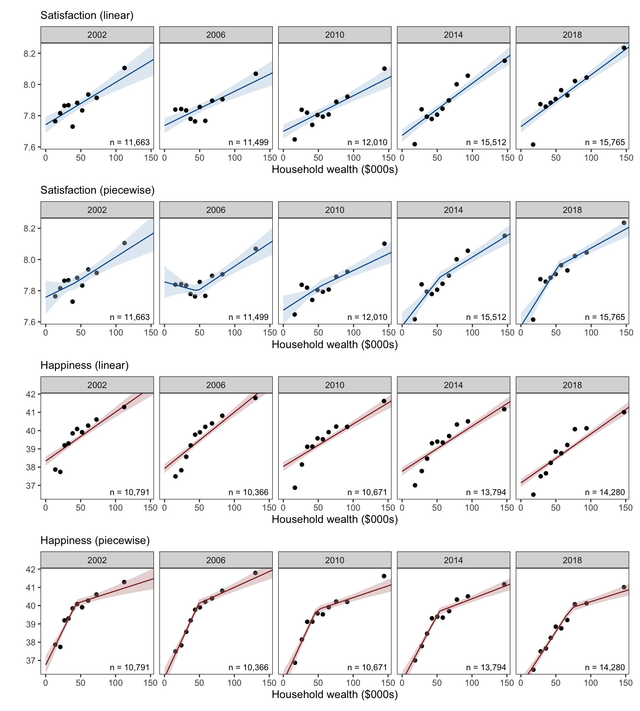
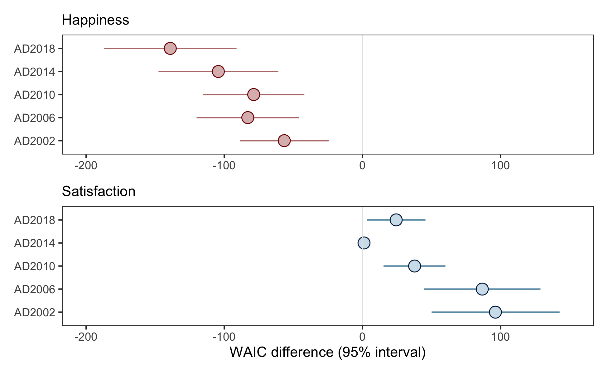
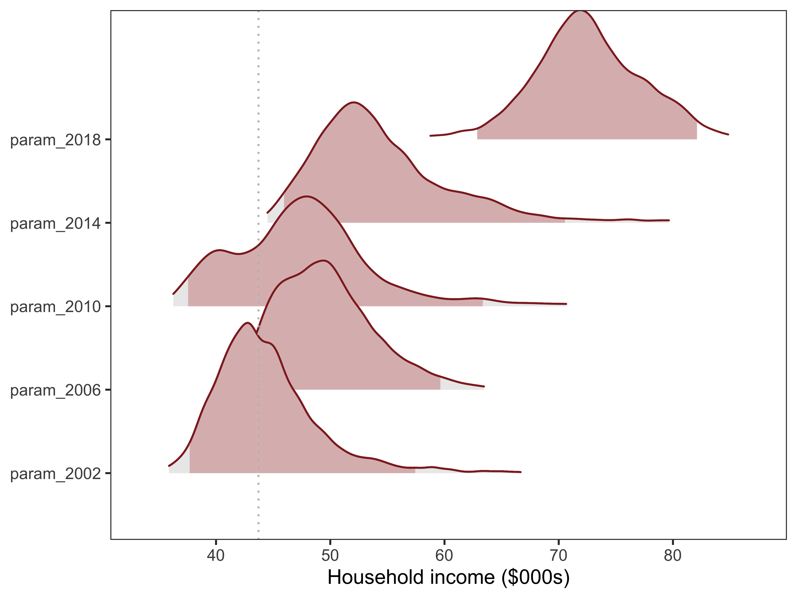
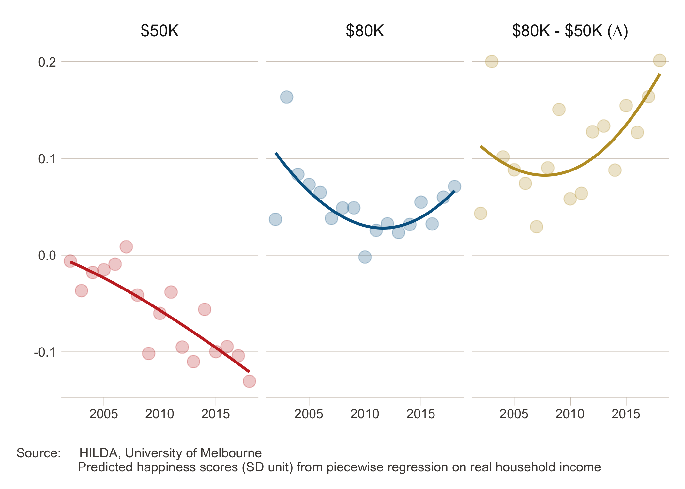
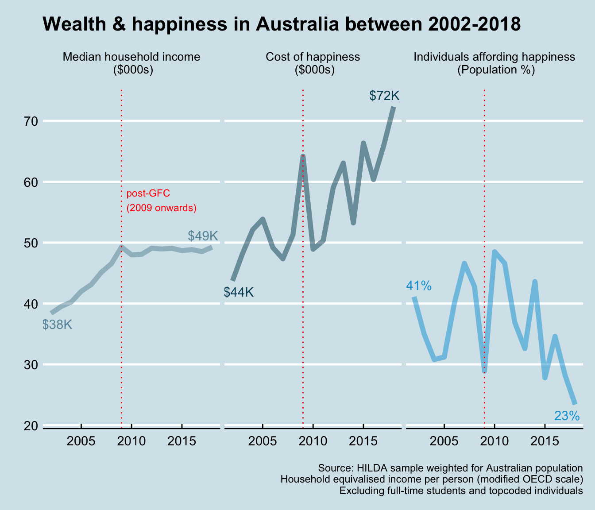

The increasing cost of happiness
================
R.W. Morris1,2, N. Kettlewell2,3,4 &
N.Glozier1,5

 

1.  Central Clinical School, Faculty of Medicine and Health, University
    of Sydney, NSW, Australia
2.  ARC Centre of Excellence for Children and Families over the Life
    Course, University of Queensland, QLD, Australia
3.  School of Economics, University of Technology, NSW, Australia
4.  Institute of Labor Economics (IZA), Bonn, Germany
5.  Brain and Mind Centre, University of Sydney, NSW, Australia

 

**Corresponding author:**

    Professor Nick Glozier  
    Faculty of Medicine and Health,   
    University of Sydney,  
    NSW 2050,  
    Australia  
    email: nick.glozier@sydney.edu.au

 

|            |                   |
| ---------- | ----------------- |
| Draft      | 02 December, 2020 |
| Word count | 3767              |
| Tables     | 1                 |
| Figures    | 5                 |

   

**keywords:** Subjective wellbeing, household wealth, HILDA

 

  

# Abstract

A fundamental question for governments and people is how much happiness
does a dollar buy? The accepted view among economists and psychologists
is that money and happiness increase together up to a point, after which
there is little further gain from increasing wealth. While the location
of this change point has been determined, and the cost of happiness
reportedly ranges between USD$60 to $95K, there has been no
investigation as to whether the cost of happiness has increased or
decreased over time. We tested the relationship between wealth and both
happiness and life satisfaction using household economic data from
Australia between 2002-2018. We discovered the cost of happiness has
increased over those 17 years faster than inflation (i.e., cost of
living). This result shows that inequalities in wealth may be driving
inequities in happiness and wellbeing, with implications for health and
recent government policy-goals to monitor and improve wellbeing. (150
words)

  

  

  

  

  

  

  

  

## Background

A fundamental question for psychology and economics is just how much
wellbeing does a dollar buy? Increasing wealth is commonly associated
with increasing wellbeing, however a point at which wealth no longer
increases subjective wellbeing has also been widely observed (Clark et
al., 2008; Dolan et al., 2008; Easterlin, 1974). Given that a central
goal of nations and governments is to improve wealth under the
assumption that wealth always increases wellbeing, challenges to this
notion have far reaching consequences (Frijters et al., 2020).

Subjective wellbeing is not a unitary entity (Diener et al., 2017);
studies typically distinguish between life satisfaction, the cognitive
appraisal of one’s own accomplishments, and happiness, one’s prevailing
affective state or emotional mood. Money can have different effects on
each. For instance, we have recently reported that positive life events,
such as a major financial windfall, have a greater impact on an
individual’s satisfaction than their happiness (Kettlewell et al.,
2020). While the distinct effect of wealth on satisfaction and happiness
was observed within individuals, the distinct effects of wealth have
also been observed across individuals. For instance, Kahneman & Deaton
(2010) showed that self-reported levels of happiness increased with
household wealth up to a point ($75,000). But after that, increasing
amounts of money had no further effect on happiness. They also reported
that life satisfaction continued to increase with wealth beyond $75,000.
Indeed, the difference between the two questions: “How satisfied are you
with your life?” and “How happy are you these days?” has been identified
as a crucial mediating factor in a meta-analysis of 111 studies on
wealth and wellbeing (Howell and Howell, 2008; also Veenhoven and
Hagerty, 2006). Results such as these have provided a more nuanced view
among psychologists and (some\!) economists about the relationship
between wealth and wellbeing; namely that wealth is more strongly
related to satisfaction than to happiness.

The distinction between satisfaction and happiness are increasingly
relevant to governments and policy-makers due to the growing recognition
that increasing wealth does not necessarily lead to improvements in
wellbeing (Clark, 2018; Frijters et al., 2020). If wealth no longer
improves wellbeing, then the maximization of wealth may no longer be a
legitimate goal of government. Fundamentally, the existence of a change
point between wealth and happiness reveals an unacknowledged inequality
in the distribution of wellbeing in the economy. Of concern is the point
at which wealth produces no further increases in happiness – that is,
the change point, or cost of happiness. The cost of happiness represents
the point at which material wealth stops driving inequalities in the
distribution of happiness in the economy, where lower cost-points
represent more equitable distributions of happiness. For instance,
Kahneman estimated the cost of happiness among US survey respondents in
2008 to be approximately USD75,000 per year, substantially more than the
US median income (USD52,000) in that year. Research since then has
revealed variations in the cost of happiness due to world region,
gender, and education (Jebb et al., 2018), consistent with financial
inequality driving inequities in wellbeing and happiness. However, to
date there has been no investigation of whether the cost of happiness
has changed over time. In particular has the cost, and therefore the
distribution, of happiness become more or less equitable in the last few
decades?

We used household economic panel data from Australia (HILDA) to provide
the first investigation of whether changes in wealth and wellbeing have
changed the cost of happiness over the last 17 years (2002-2018). HILDA
provides a representative sample of households in Australia with
detailed measurements of wealth and subjective wellbeing in the same
sample, which makes it an excellent data source to investigate the
present question. We distinguished between satisfaction and happiness as
different components of subjective wellbeing, and evaluated how each
varies with household wealth. After adjusting for age, gender, and
education level, we confirmed that happiness and satisfaction have
distinct relationships with increasing wealth, but the cost of happiness
has increased in real dollar terms since 2002.

 

## Methods

 

#### Wealth

Our indicator of wealth and economic security was household income.
Household income better represents economic security, since members of
the same household share expenses as well as risks; i.e., they can
provide a direct and immediate support network when financial shocks
occur. The other major studies also used household after-tax income as
the indicator of wealth and economic security (e..g, Kahneman and
Deaton, 2010; Jebb et al., 2018), and so we follow the same standard
here as well. The ‘real household annual disposable income’ was
calculated from the combined income of all household members after
receipt of government pensions and benefits and deduction of income
taxes in the financial year ended 30th June of the year of the wave
(e.g., 2002 in wave 2). This was then adjusted for inflation - the rise
in the general price level of the economy - using the Australian Bureau
of Statistics (ABS) Consumer Price Index, so that income in all waves is
expressed in FY 2017/18 prices, to give real income.

The *equivalised* household income was obtained by adjusting for
household size (the number of adult and child household members). In
this instance, we have used the ‘modified OECD’ scale (Hagenaars et al.,
1994), which divides household income by 1 for the first household
member plus 0.5 for each other household member aged 15 or over, plus
0.3 for each child under 15. A family comprising two adults and two
children under 15 years of age would therefore have an equivalence scale
of 2.1 (1 + 0.5 + 0.3 + 0.3), meaning that the family would need to have
an income 2.1 times that of a single-person household in order to
achieve the same standard of living. This scale recognises that larger
households require more income, but it also recognises that there are
economies of scale in consumption and that children require less than
adults. The equivalised income calculated for a household is then
assigned to each member of the household.

 

#### Subjective Wellbeing

There are a variety of variables related to subjective well-being
collected annually in HILDA, but the two we used here matched the
variables we used in our previous paper (Kettlewell et al., 2020),
namely, life satisfaction as a measure of cognitive wellbeing, and the
SF-36 as a measure of affective wellbeing or happiness.

Life satisfaction
[(losat)](https://www.online.fbe.unimelb.edu.au/HILDAodd/KWCrossWaveCategoryDetails.aspx?varnt=losat)
was assessed by a single item question asked each survey: “All things
considered, how satisfied are you with your life (0 to 10)”.

Happiness was determined by item 9 in the SF-36 [(gh9a to
gh9i)](https://www.online.fbe.unimelb.edu.au/HILDAodd/KWCrossWaveCategoryDetails.aspx?varnt=gh9a).
The SF-36 is a widely used self-completion measure of various aspects of
physical, emotional and mental health (Ware Jr, 2000). Item 9 consists
of nine questions relating to mental health and vitality, where five
questions deal with positive and negative aspects of mental health
(e.g., “Felt so down in the dumps nothing could cheer me up”, “Been
happy”), and four questions deal with positive and negative aspects of
vitality (e.g., “feel full of life”, “felt worn out”). Each question
referred to the past four weeks and agreement was indicated on a
six-point scale. We reverse scored the relevant responses and calculated
the sum of the nine questions so that higher scores represented better
wellbeing. To aid interpretability, we rescaled the final sum to a score
between 1-100, where 100 represents the maximum happiness achievable.

For modelling, both dependent variables were rescaled with a mean of
zero and a SD of 1 (z-scores) for each year.

 

#### Modelling

We modelled the relationship between wealth and each wellbeing variable
(happiness and satisfaction) using a simple **linear model** and a
**piecewise model** (broken-stick). The piecewise model was chosen as
the simplest extension of a linear model which can identify a change
point (inflection) between wellbeing and wealth. The location of the
change point was a free parameter which revealed where wellbeing no
longer increased at a uniform rate with wealth. We then compared the
linear model against the piecewise model to determine if a change point
existed in any year between household wealth and each wellbeing variable
(see Model Selection). Finally, where a change point existed, we
determined the location of the change point for that year (see Parameter
Estimation).

*Model Estimation*  
We adopted a Bayesian approach for estimating the linear and piecewise
model in the software Stan (Bürkner, 2017; Stan Development Team, 2019).
In each case,

Let \(y_i \sim N(\mu_i, \sigma^2_y)\)

The linear model was estimated as:

\[
\mu_i = \beta_0 + \beta_1 X_i 
\]

Where \(X_i\) was an individual’s household wealth ($) as well as other
covariates (age, age2, sex, education), and \(y_i\) was an
individual’s wellbeing.

 

The piecewise model was a simple extension of this to include a free
parameter to represent the changepoint in wealth (\(\omega\)) as well as
the slope before the change point (\(\beta_1\)) and after the change
point (\(\beta_2\)):

\[
\mu_i = \beta_0 + \beta_1 (x_i - \omega) (x_i ≤ \omega) + \beta_2 (x_i - \omega) (x_i > \omega) + \beta_3 X_i
\]

Where \(x_i\) was an individual’s household wealth, and \(X_i\) were
covariates for age, age2, sex and education.

 

The above models estimated population-level effects separately for each
year (*t* = 2002, 2006, 2010, 2014 and 2018). Because we were interested
in the location of the change point between wealth and wellbeing that
existed across individuals within each year, we ignored the panel design
of HILDA because the dependency between observations of the same person
across years was orthogonal to our effects of interest. We specified
weakly informed priors for each *β*, and a uniform prior over the
restricted range of wealth values for *ω*.

*Model Selection*  
To determine whether wellbeing was a linear or non-linear (e.g.,
piecewise) function of wealth, we compared the linear and piecewise
model posterior probabilities using the [Widely Applicable Information
Criterion
(WAIC)](https://bookdown.org/ajkurz/Statistical_Rethinking_recoded/overfitting-regularization-and-information-criteria.html#the-problem-with-parameters).
The WAIC is the log-posterior predictive density plus a penalty
proportional to the variance in the posterior distribution. Thus it
provides an approximation of the out-of-sample deviance that converges
to the cross-validation approximation in a large sample, with a penalty
for the effective number of parameters (degrees of freedom). For this
reason is it useful to compare two models of varying complexity, such as
our linear and piecewise model.

WAIC was defined as: WAIC = -2(lppd - *p*WAIC)

Where lppd (log pointwise predictive density) is the total across
observations of the log of the average likelihood of each observation,
and *p*WAIC is the effective number of free parameters
determined by the sum of the variance in log-likelihood for each
observation (*i*).

*Parameter Estimation*  
To determine the location of the change point (*ω*) between wellbeing
and wealth, we modelled the relationship between wealth and wellbeing
across individuals using the piecewise model described above, and
sampled the posterior probability of *ω* over 4000 interations. The
complete posterior distribution of *ω* for each year is presented along
with the expected value (mean).

 

*Covariates*  
Age (and age2), gender, and education were included as
covariates. Full-time students were removed, as well as individuals with
an annual household disposable income that was indicated as *topcoded*
by the University of Melbourne (topcoding occurs to ensure privacy of
high wealth individuals). Gender was included as a binary variable (Male
= 1), and education was a binary variable coded from the highest level
of education achieved (university/college graduate = 1).

 

## Results

The broad demographic characteristics of the sample over the time period
are presented below in Table 1 (at four year
intervals).

<table class="table table-striped" style="margin-left: auto; margin-right: auto;">

<caption>

Table 1. Demographic characteristics

</caption>

<thead>

<tr>

<th style="text-align:left;">

Characteristic

</th>

<th style="text-align:left;">

2002 N = 11,635

</th>

<th style="text-align:left;">

2006 N = 11,474

</th>

<th style="text-align:left;">

2010 N = 11,993

</th>

<th style="text-align:left;">

2014 N = 15,496

</th>

<th style="text-align:left;">

2018 N = 15,721

</th>

</tr>

</thead>

<tbody>

<tr>

<td style="text-align:left;">

Life satisfaction

</td>

<td style="text-align:left;">

7.9 (±1.6)

</td>

<td style="text-align:left;">

7.9 (±1.5)

</td>

<td style="text-align:left;">

7.8 (±1.5)

</td>

<td style="text-align:left;">

7.9 (±1.5)

</td>

<td style="text-align:left;">

7.9 (±1.5)

</td>

</tr>

<tr>

<td style="text-align:left;">

Happiness

</td>

<td style="text-align:left;">

68.3 (±16.8)

</td>

<td style="text-align:left;">

68.3 (±16.7)

</td>

<td style="text-align:left;">

67.9 (±16.6)

</td>

<td style="text-align:left;">

67.6 (±17.1)

</td>

<td style="text-align:left;">

66.5 (±17.3)

</td>

</tr>

<tr>

<td style="text-align:left;">

Sex

</td>

<td style="text-align:left;">

</td>

<td style="text-align:left;">

</td>

<td style="text-align:left;">

</td>

<td style="text-align:left;">

</td>

<td style="text-align:left;">

</td>

</tr>

<tr>

<td style="text-align:left; padding-left: 2em;" indentlevel="1">

Female

</td>

<td style="text-align:left;">

6,088 (52%)

</td>

<td style="text-align:left;">

6,069 (53%)

</td>

<td style="text-align:left;">

6,296 (52%)

</td>

<td style="text-align:left;">

8,100 (52%)

</td>

<td style="text-align:left;">

8,241 (52%)

</td>

</tr>

<tr>

<td style="text-align:left; padding-left: 2em;" indentlevel="1">

Male

</td>

<td style="text-align:left;">

5,547 (48%)

</td>

<td style="text-align:left;">

5,405 (47%)

</td>

<td style="text-align:left;">

5,697 (48%)

</td>

<td style="text-align:left;">

7,396 (48%)

</td>

<td style="text-align:left;">

7,480 (48%)

</td>

</tr>

<tr>

<td style="text-align:left;">

Age (years)

</td>

<td style="text-align:left;">

46.4 (±16.6)

</td>

<td style="text-align:left;">

46.8 (±17.3)

</td>

<td style="text-align:left;">

46.9 (±17.7)

</td>

<td style="text-align:left;">

47.7 (±17.8)

</td>

<td style="text-align:left;">

48.2 (±18.2)

</td>

</tr>

<tr>

<td style="text-align:left;">

Education

</td>

<td style="text-align:left;">

</td>

<td style="text-align:left;">

</td>

<td style="text-align:left;">

</td>

<td style="text-align:left;">

</td>

<td style="text-align:left;">

</td>

</tr>

<tr>

<td style="text-align:left; padding-left: 2em;" indentlevel="1">

High school or less

</td>

<td style="text-align:left;">

9,348 (80%)

</td>

<td style="text-align:left;">

8,943 (78%)

</td>

<td style="text-align:left;">

9,186 (77%)

</td>

<td style="text-align:left;">

11,408 (74%)

</td>

<td style="text-align:left;">

11,268 (72%)

</td>

</tr>

<tr>

<td style="text-align:left; padding-left: 2em;" indentlevel="1">

Graduate

</td>

<td style="text-align:left;">

2,281 (20%)

</td>

<td style="text-align:left;">

2,526 (22%)

</td>

<td style="text-align:left;">

2,800 (23%)

</td>

<td style="text-align:left;">

4,077 (26%)

</td>

<td style="text-align:left;">

4,445 (28%)

</td>

</tr>

<tr>

<td style="text-align:left;">

Workforce

</td>

<td style="text-align:left;">

</td>

<td style="text-align:left;">

</td>

<td style="text-align:left;">

</td>

<td style="text-align:left;">

</td>

<td style="text-align:left;">

</td>

</tr>

<tr>

<td style="text-align:left; padding-left: 2em;" indentlevel="1">

Employed

</td>

<td style="text-align:left;">

7,323 (63%)

</td>

<td style="text-align:left;">

7,568 (66%)

</td>

<td style="text-align:left;">

7,861 (66%)

</td>

<td style="text-align:left;">

9,916 (64%)

</td>

<td style="text-align:left;">

10,141 (65%)

</td>

</tr>

<tr>

<td style="text-align:left; padding-left: 2em;" indentlevel="1">

Unemployed

</td>

<td style="text-align:left;">

389 (3.3%)

</td>

<td style="text-align:left;">

290 (2.5%)

</td>

<td style="text-align:left;">

384 (3.2%)

</td>

<td style="text-align:left;">

550 (3.5%)

</td>

<td style="text-align:left;">

500 (3.2%)

</td>

</tr>

<tr>

<td style="text-align:left; padding-left: 2em;" indentlevel="1">

Not in labour force

</td>

<td style="text-align:left;">

3,923 (34%)

</td>

<td style="text-align:left;">

3,616 (32%)

</td>

<td style="text-align:left;">

3,748 (31%)

</td>

<td style="text-align:left;">

5,030 (32%)

</td>

<td style="text-align:left;">

5,080 (32%)

</td>

</tr>

<tr>

<td style="text-align:left;">

Relationship status

</td>

<td style="text-align:left;">

</td>

<td style="text-align:left;">

</td>

<td style="text-align:left;">

</td>

<td style="text-align:left;">

</td>

<td style="text-align:left;">

</td>

</tr>

<tr>

<td style="text-align:left; padding-left: 2em;" indentlevel="1">

Single

</td>

<td style="text-align:left;">

1,847 (16%)

</td>

<td style="text-align:left;">

1,913 (17%)

</td>

<td style="text-align:left;">

2,063 (17%)

</td>

<td style="text-align:left;">

2,669 (17%)

</td>

<td style="text-align:left;">

2,782 (18%)

</td>

</tr>

<tr>

<td style="text-align:left; padding-left: 2em;" indentlevel="1">

Married

</td>

<td style="text-align:left;">

7,956 (68%)

</td>

<td style="text-align:left;">

7,737 (67%)

</td>

<td style="text-align:left;">

8,106 (68%)

</td>

<td style="text-align:left;">

10,558 (68%)

</td>

<td style="text-align:left;">

10,630 (68%)

</td>

</tr>

<tr>

<td style="text-align:left; padding-left: 2em;" indentlevel="1">

Divorced/Widow

</td>

<td style="text-align:left;">

1,832 (16%)

</td>

<td style="text-align:left;">

1,824 (16%)

</td>

<td style="text-align:left;">

1,824 (15%)

</td>

<td style="text-align:left;">

2,269 (15%)

</td>

<td style="text-align:left;">

2,309 (15%)

</td>

</tr>

<tr>

<td style="text-align:left;">

Chronic illness

</td>

<td style="text-align:left;">

2,735 (24%)

</td>

<td style="text-align:left;">

3,278 (29%)

</td>

<td style="text-align:left;">

3,467 (29%)

</td>

<td style="text-align:left;">

4,757 (31%)

</td>

<td style="text-align:left;">

4,849 (31%)

</td>

</tr>

<tr>

<td style="text-align:left;">

SEIFA

</td>

<td style="text-align:left;">

5.5 (±2.9)

</td>

<td style="text-align:left;">

5.6 (±2.8)

</td>

<td style="text-align:left;">

5.6 (±2.8)

</td>

<td style="text-align:left;">

5.5 (±2.8)

</td>

<td style="text-align:left;">

5.6 (±2.8)

</td>

</tr>

<tr>

<td style="text-align:left;">

Household size

</td>

<td style="text-align:left;">

2.8 (±1.4)

</td>

<td style="text-align:left;">

2.8 (±1.4)

</td>

<td style="text-align:left;">

2.8 (±1.4)

</td>

<td style="text-align:left;">

2.8 (±1.5)

</td>

<td style="text-align:left;">

2.8 (±1.4)

</td>

</tr>

</tbody>

<tfoot>

<tr>

<td style="padding: 0; border: 0;" colspan="100%">

1 Statistics presented: Mean (±SD); n (%)

</td>

</tr>

</tfoot>

</table>

 

Average life satisfaction levels were very steady between 2002-2018,
while average happiness score decreased slightly over the 17 years. The
proportions of each sex and relationship status were stable over time,
as were the average household size and SEIFA index. However age and
chronic health conditions tended to increase over time, as expected in
an aging sample. Education levels (i.e., graduate percentage) also
tended to increase over time, while changes in the workforce varied both
up and down.

 

Below we show the relationship between household income and wellbeing
(Figure 1). For visualization purposes only, due to the large numbers of
individual data in each year, we display the mean levels of income and
wellbeing for each (equal-sized) income decile rather than every
individual data point. Note that the line-of-best-fit and 95% credible
intervals (shaded) from each regression model *of all individuals* is
shown in
overlay.

 

##### Figure 1. Household income and satisfaction (blue) and happiness (red)

<!-- -->

    Figure 1 legend: Posterior predictive distributions (95% credible intervals) showing the model fit from regressions of wellbeing on household income, overlaid on summary data points (income deciles). Wellbeing was measured as life satisfaction (blue) or happiness (red). The total number of individuals contributing to each year are shown (n).

 

Figure 1 shows the relationship between household income and
satisfaction appeared relatively linear, as the results of the piecewise
regression indicated the inflection of the change point could be
increasing (e.g., 2002, 2006) as well as decreasing (e.g., 2010, 2014,
2018). By contrast, a decreasing change point was evident in each year
of happiness on income. The results of a formal comparison between
linear and piecewise models is provided in Model Selection below.
However note that the change point between income and happiness appeared
to shift rightwards over time (bottom row). (We can also see the linear
relationship between household income and each wellbeing variable became
slightly weaker over time, i.e., less steep)

 

#### Model Selection

We compared the posterior evidence for a linear relationship between
wellbeing and income with the posterior evidence of a nonlinear
(piecewise) relationship (i.e., WAIClinear —
WAICpiecewise). Thus a WAIC difference greater than zero
indicated evidence for a linear relationship. A WAIC difference less
than zero indicated evidence for a nonlinear (piecewise)
relationship.

 

##### Figure 2. Linear model evidence (WAIClinear — WAICpiecewise)

<!-- -->

    Figure 2 legend: Differences in posterior evidence for a linear fit over a piecewise fit (WAIC) for satisfaction (blue) and happiness (red). The filled circle indicates the mean of the distribution and the horizontal bars represents the 95% credible interval. A difference greater than zero is support for the linear model and a difference below zero is support for the piecewise model.

  

Model selection revealed the posterior evidence for the linear fit of
satisfaction on income was credibly superior to the nonlinear
(piecewise) fit - Figure 2 shows the 90% credible interval of the fit
for each year of satisfaction was above zero with no overlap. By
contrast, a nonlinear fit of happiness on income was generally superior,
and the nonlinear fit was credibly superior at 90% for each of three
years (2006, 2014, 2018). Thus, the posterior evidence indicates
happiness and satisfaction have distinct relationships with household
income; satisfaction tends to increase linearly with income, while a
change point exists in the relationship between happiness and income.

 

#### Parameter Estimation

Figure 3 below presents the complete posterior distribution of ω over
4000 samples drawn from the piecewise model, representing the location
of the change point between happiness and household income in four
separate years. Shaded areas to the right of the vertical grey dotted
line are credibly (95%) larger than 2002. The figure shows the change
point between happiness and household income (the *cost of happiness*)
credibly increased between 2002 and
    2018.

 

##### Figure 3. Posterior distributions of ω (95% distribution)

<!-- -->

    Figure 3 legend: Posterior distribution of the change point parameter representing the location in household income ($) for each year. Shaded area represents the 90% credible region.

 

#### Wealth and happiness

##### Figure 4. Estimated happiness (SD units) at $50K/yr and $80K/yr from 2002-2018

<!-- -->

    Figure 4 legend: The difference (∆) in happiness between individuals with a household income of $50K per year and a household income of $80K per year has increased since 2009.

 

Figure 5 presents house income levels weighted for the Australian
population (by age, sex, marital status, labour force participation and
region). It shows the cost of happiness increased faster than household
income between 2002 and 2018. As a result, a smaller percentage of the
Australian population in 2018 achieved a level of financial security on
which their happiness was no longer dependent on their income, relative
to
    2002.

 

##### Figure 5.

<!-- -->

    Figure 5 legend: Real household income has stagnated in Australia since 2009 (post GFC) while the cost of happiness has increased. Consequently fewer Australians have a household income exceeding the cost of happiness in 2018.

  

## Conclusions

We found the relationship between subjective wellbeing and household
income was positive, but happiness and satisfaction had different
(positive) relationships: Satisfaction increased linearly with income,
while happiness increased rapidly up to a point after which further
increments in income produced less change – this confirms the distinct
effects of wealth in previous research (e.g., Howell and Howell, 2008;
Kahneman and Deaton, 2010), and contributes rare evidence from the same
sample. Furthermore, we report here for the first time that the change
point between household income and happiness increased over time between
2002 and 2018, faster than inflation or the median household income.

We refer to the change point after which increases in wealth no longer
produce similar increases in happiness as the cost of happiness. After
this point, happiness is no longer as dependent on household income, and
the economic security it represents. Presumably after this point further
increases in happiness depend on other life factors (e.g., social
connections). Life satisfaction on the other hand always increased with
household income. The difference likely reflects the importance of a
numerical dollar value (e.g., bank balance, house value) when
cognitively appraising one’s life achievements, versus the relevance of
that number to our everyday experience of joy and prevailing mood.

An implication of the increasing cost of happiness over the last sixteen
years is that wealth inequality is driving increasing *inequities* in
wellbeing. In 2002, the cost point of happiness represented a 9%
increase over median wealth, while in 2018 it represented a 42% increase
over median wealth. This also represents a reduction from 44% to 26% in
the proportion of people who have achieved a level of financial security
beyond which their happiness no longer depends. Thus we can see that
over time in the last sixteen years the happiness of more people, i.e.,
their everyday experience of joy and their prevailing mood, has depended
on their material wealth.

Australia has low levels of wealth disparity relative to other OECD
countries, and the Gini coefficient has not changed a great deal between
2002 and 2018 in the HILDA dataset (Commission and others, 2018). A
stable Gini coefficient shows income inequality has remained steady over
the time period, and our results do not conflict with this conclusion.
Rather what we are revealing is the effect of income inequality on
happiness has increased over the same time period. So while income
inequality has remained steady, it’s impact on wellbeing inequity has
increased. We think this highlights the issue that while traditional
measures of wealth and income inequality may be relatively stable and
exhibit little change, their impact on wellbeing and health can still
vary. As focus shifts from traditional wealth indicators towards
wellbeing measures, findings such as this may become more prevalent.

Some recent studies have challenged either the notion that the positive
effect of household income plateaus, or that the effect on happiness and
satisfaction are distinct. In a nationally representative sample of
44,000 adult Americans in the General Social Survey (GSS), happiness
continued to increase with household income, implying no change point
existed between money and happiness (Twenge and Cooper, 2020). The GSS
asks a single item on happiness: “Taken all together, how would you say
things are these days – would you say that you are very happy, pretty
happy, or not too happy?” The form of this question is quite similar to
the single item “life satisfaction” question in HILDA, as both request
the respondent to cognitively evaluate their circumstances. By contrast,
the nine items we selected to measure happiness covered a range of
affect and focused on current feelings: e.g., “How much of the time
during the past 4 weeks have you been a happy person?”. Critical
differences in the operational definition of happiness seem likely to
explain the distinct results observed here.

A second recent report from a survey of 1.7 million people representing
164 countries in the Gallup World Poll reported increases in household
income were associated with change points in happiness and satisfaction
(Jebb et al., 2018), rather than distinct effects as we found. It may be
that differences in the sparsity of the high income data in HILDA (for
which extremely high income households are masked) explain the
differences here. However including these individuals in our analysis
did not change the linear effect between wealth and satisfaction
observed here, and the weighted topcodes should have biased the result
towards a change point. We also note a linear effect between wealth and
satisfaction is consistent with the majority of earlier literature
(Howell and Howell, 2008; Stevenson and Wolfers, 2013).

As governments and policy-makers begin to focus on wellbeing, it will be
critical to understand how traditional economic indicators such as
household income, wealth inequality, and consumption interact with
wellbeing and health. According to Frijters et al. (2020), coming up
with a consensus to translate income into wellbeing features high on the
wider wellbeing research agenda. Establishing the links between wealth,
household income, wellbeing and health, and how inequalities in one
drives inequities in the other, will be a critical step in that agenda.

 

## References

Bürkner, P.-C., 2017. brms: An R package for Bayesian multilevel models
using Stan. Journal of Statistical Software 80, 1–28.
<https://doi.org/10.18637/jss.v080.i01>

Clark, A.E., 2018. Four decades of the economics of happiness: Where
next? Review of Income and Wealth 64, 245–269.

Clark, A.E., Frijters, P., Shields, M.A., 2008. Relative income,
happiness, and utility: An explanation for the easterlin paradox and
other puzzles. Journal of Economic literature 46, 95–144.

Commission, A.G.-P., others, 2018. Rising inequality? A stocktake of the
evidence. Productivity Commission Research Paper.

Diener, E., Heintzelman, S.J., Kushlev, K., Tay, L., Wirtz, D., Lutes,
L.D., Oishi, S., 2017. Findings all psychologists should know from the
new science on subjective well-being. Canadian Psychology/psychologie
canadienne 58, 87.

Dolan, P., Peasgood, T., White, M., 2008. Do we really know what makes
us happy? A review of the economic literature on the factors associated
with subjective well-being. Journal of economic psychology 29, 94–122.

Easterlin, R.A., 1974. Does economic growth improve the human lot? Some
empirical evidence, in: Nations and Households in Economic Growth.
Elsevier, pp. 89–125.

Frijters, P., Clark, A.E., Krekel, C., Layard, R., 2020. A happy choice:
Wellbeing as the goal of government. Behavioural Public Policy 4,
126–165.

Howell, R.T., Howell, C.J., 2008. The relation of economic status to
subjective well-being in developing countries: A meta-analysis.
Psychological bulletin 134, 536.

Jebb, A.T., Tay, L., Diener, E., Oishi, S., 2018. Happiness, income
satiation and turning points around the world. Nature Human Behaviour 2,
33–38.

Kahneman, D., Deaton, A., 2010. High income improves evaluation of life
but not emotional well-being. Proceedings of the national academy of
sciences 107, 16489–16493.

Kettlewell, N., Morris, R.W., Ho, N., Cobb-Clark, D.A., Cripps, S.,
Glozier, N., 2020. The differential impact of major life events on
cognitive and affective wellbeing. SSM-population health 10, 100533.

Stan Development Team, 2019. RStan: The R interface to Stan.

Stevenson, B., Wolfers, J., 2013. Subjective well-being and income: Is
there any evidence of satiation? American Economic Review 103, 598–604.

Twenge, J.M., Cooper, A.B., 2020. The expanding class divide in
happiness in the united states, 1972–2016. Emotion.

Veenhoven, R., Hagerty, M., 2006. Rising happiness in nations 1946–2004:
A reply to easterlin. Social indicators research 79, 421–436.

Ware Jr, J.E., 2000. SF-36 health survey update. Spine 25, 3130–3139.

