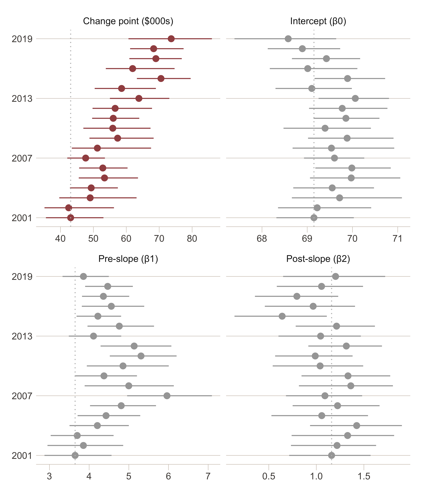
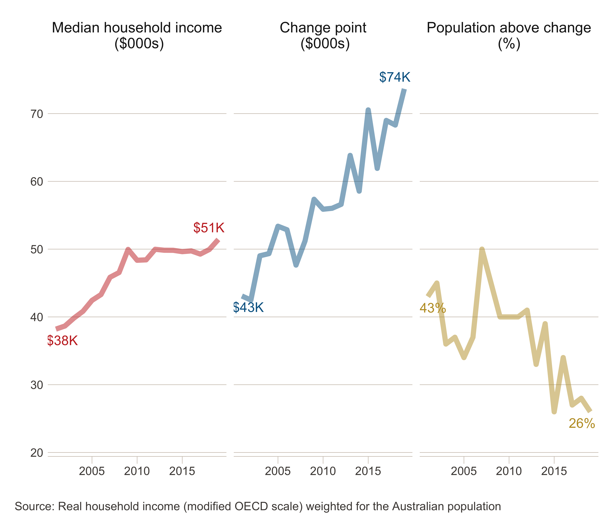

The increasing cost of happiness
================
R.W. Morris<sup>1,2</sup>, N. Kettlewell<sup>2,3,4</sup> &
N.Glozier<sup>1,5</sup>

 

1.  Central Clinical School, Faculty of Medicine and Health, University
    of Sydney, NSW, Australia
2.  ARC Centre of Excellence for Children and Families over the Life
    Course, University of Sydney, NSW, Australia
3.  School of Economics, University of Technology, NSW, Australia
4.  Institute of Labor Economics (IZA), Bonn, Germany
5.  Brain and Mind Centre, University of Sydney, NSW, Australia

 

**Corresponding author:**

    Professor Nick Glozier  
    Faculty of Medicine and Health,   
    University of Sydney,  
    NSW 2050,  
    Australia  
    email: nick.glozier@sydney.edu.au

 

|         |                   |
| ------- | ----------------- |
| Draft   | 08 February, 2021 |
| Words   | 4789              |
| Tables  | 0                 |
| Figures | 4                 |

   

**keywords:** Subjective wellbeing, household income, HILDA

 

<br><br>

# Abstract

A fundamental question for society is how much happiness does a dollar
buy? The accepted view among economists and psychologists is that money
and happiness increase together up to a point, after which there is
little further gain from increasing wealth. While the location of this
change point reportedly ranges between USD$60K to $95K, there has been
no investigation as to whether this has increased or decreased over
time. We tested the temporal relationship between income and affective
wellbeing (happiness), and income and cognitive wellbeing (life
satisfaction), using household economic data from Australia between
2002-2018. We discovered the change point between happiness and income
has increased over those 17 years faster than inflation (i.e., cost of
living). This suggests that inequalities in income may be driving
increasing inequities in happiness between the rich and the poor, with
implications for health and recent government policy-goals to monitor
and improve wellbeing. (250 words max)

<br><br>

<br><br>

<br><br>

<br><br>

<br><br>

<br><br>

<br><br>

<br><br>

## Significance Statement

Substantial research has shown that higher incomes have decreasing gains
on wellbeing and happiness, across countries, cultures and ethnicities,
with an inflection or change point at or near USD75,000. At incomes
below this point happiness is dependent on financial security while at
income levels above, happiness is relatively independent; revealing an
inequality in the distribution of happiness between rich and poor.
However we do not know whether or how this point has itself changed over
time. Has it decreased and reduced inequality, or increased the
difference between the rich and poor? We examine 17 years of data from a
single developed western nation (Australia) and determine that the
happiness of more people are dependent on financial security than
before.

<br><br>

## Background

A fundamental question for governments and people is just how much
wellbeing does a dollar buy? Increasing income is commonly associated
with increasing happiness and wellbeing, however a point at which
subjective wellbeing no longer increases with income has also been
widely observed (Clark et al., 2008; Dolan et al., 2008; Easterlin,
1974). Given that a central goal of nations and governments is to
improve income under the assumption that higher income always increases
wellbeing, challenges to this notion have far reaching consequences
(Frijters et al., 2020; Laws and Monitor, 2014).

Subjective wellbeing is not a unitary entity (Diener et al., 2017);
studies typically distinguish between life satisfaction, the cognitive
appraisal of one’s own accomplishments, and affective wellbeing, one’s
prevailing affective state, emotional mood, or everyday experience of
happiness. Money can have different effects on each. For instance, we
have recently reported that large increases in wealth, such as a major
financial windfall, have a greater impact on an individual’s life
satisfaction than their happiness (Kettlewell et al., 2020). The
distinct effect of money on satisfaction and happiness was observed
within an individual over time, however a distinct effect of income have
also been observed between people with different income levels. For
instance, Kahneman & Deaton (2010) showed that self-reported levels of
happiness increased with household income up to a point (USD75,000), but
after that, increasing income had little further effect on happiness.
Conversely life satisfaction continued to increase with income beyond
USD75,000. Indeed, the difference between the two questions: “How
satisfied are you with your life?” and “How happy are you these days?”
has been identified as a crucial mediating factor in a meta-analysis of
111 studies on income and wellbeing (Howell and Howell, 2008; also
Veenhoven and Hagerty, 2006). Results such as these have provided a more
nuanced view among psychologists and some economists regarding the
relationship between income and wellbeing; namely that income is more
strongly related to satisfaction than to happiness.

Fundamentally, the existence of a change point in the relationship
between income and happiness reveals an unacknowledged source of
inequality in the distribution of wellbeing (i.e., happiness) in the
economy. For instance, the change point of USD75,000 reported by
Kahneman in 2008 was substantially more than the US median income of
USD52,000 in the same year, indicating that the happiness of the poorest
majority of the US population was tied to marginal changes in income
while the happiness of a richer minority was not. Thus the change point
represents the dollar value up to which income drives inequities in the
distribution of happiness, such that a lower value represents a more
equitable distribution of happiness in the economy. Inequities in the
distribution of wellbeing are increasingly relevant to governments and
policy-makers due to the growing recognition that increasing income does
not necessarily lead to equal changes in wellbeing (Clark, 2018;
Frijters et al., 2020). Even prior to COVID-19, the World Gallup Poll
has observed that happiness has been decreasing over the past decade in
western Europe, north America, Australia and New Zealand, despite
increases in income in the same countries (Sachs et al., 2019). However
to date there has been no investigation of whether the relationship
between income and happiness has changed over time which may contribute
to these social trends. In particular has the change point between
income and happiness, and therefore the distribution of happiness
between rich and poor, become more or less equitable in the last few
decades?

<br>

## Methods

We used household economic panel data from Australia (HILDA) to provide
the first investigation of whether changes in income and wellbeing have
shifted the change point over the last 17 years (2002-2018). HILDA
provides a representative sample of households in Australia with
detailed measurements of income and subjective wellbeing in the same
sample, which makes it an excellent data source to investigate the
present question. We distinguished between satisfaction and happiness as
different components of subjective wellbeing, and evaluated how each
varies with household income. Full-time students were removed, as well
as individuals with an annual household disposable income designated as
*topcoded* (which occurs to ensure confidentiality of very high income
individuals who might otherwise be identifiable).

<br>

#### Income

To allow comparison with other major studies of income and wellbeing we
used household after-tax income as the indicator of income and economic
security (e..g, Kahneman and Deaton, 2010; Jebb et al., 2018). Household
income better represents economic security than personal income, since
members of the same household share expenses as well as risks; i.e.,
they can provide a direct and immediate support network when financial
shocks occur, which a priori might affect wellbeing. The ‘real household
annual disposable income’ was calculated from the self-reported combined
income of all household members after receipt of government pensions and
benefits and deduction of income taxes in the financial year ended 30th
June of the year of the wave (e.g., 2002 in wave 2). This was then
adjusted for inflation - the rise in the general price level of the
economy - using the Australian Bureau of Statistics (ABS) Consumer Price
Index, so that income in all waves is expressed in FY 2017/18 prices, to
give real income.

The *equivalised* household income was obtained by adjusting for
household size (the number of adult and child household members). In
this instance, we have used the ‘modified OECD’ scale (Hagenaars et al.,
1994), which divides household income by 1 for the first household
member plus 0.5 for each other household member aged 15 or over, plus
0.3 for each child under 15. A family comprising two adults and two
children under 15 years of age would therefore have an equivalence scale
of 2.1 (1 + 0.5 + 0.3 + 0.3), meaning that the family would need to have
an income 2.1 times that of a single-person household in order to
achieve the same standard of living. This scale recognises that larger
households require more income, but it also recognises that there are
economies of scale in consumption and that children require less than
adults. The equivalised income calculated for a household is then
assigned to each member of the household.

<br>

#### Subjective Wellbeing

There are a variety of variables related to subjective well-being
collected annually in HILDA, but the two we used here matched the
variables we used in our previous paper (Kettlewell et al., 2020),
namely, life satisfaction as a measure of cognitive wellbeing, and item
9 from the SF-36 (9a-9i) as a measure of affective wellbeing or
happiness.

Life satisfaction
[(losat)](https://www.online.fbe.unimelb.edu.au/HILDAodd/KWCrossWaveCategoryDetails.aspx?varnt=losat)
was assessed by a single item question asked each survey: “All things
considered, how satisfied are you with your life (0 to 10)”.

Happiness was determined by 9 questions in the SF-36 [(9a
to 9i)](https://www.online.fbe.unimelb.edu.au/HILDAodd/KWCrossWaveCategoryDetails.aspx?varnt=gh9a).
The SF-36 is a widely used self-completion measure of various aspects of
physical, emotional and mental health (Ware Jr, 2000). A subset of 9
questions assess mental health and vitality, with five questions
measuring positive and negative aspects of mental health (e.g., “Felt so
down in the dumps nothing could cheer me up”, “Been happy”), and four
questions on positive and negative aspects of vitality (e.g., “feel full
of life”, “felt worn out”). The response scale timeframe is the past
four weeks and agreement was indicated on a six-point Likert scale. We
reverse scored negatively phrased questions and calculated the sum of
the nine questions so that higher scores represented better wellbeing.
To aid interpretability, we rescaled the final sum to a score between
1-100, where 100 represents the maximum happiness achievable.

For modelling, both dependent variables were rescaled with a mean of
zero and a SD of 1 (z-scores) for each year.

<br>

#### Modelling

We modelled the relationship between income and each wellbeing variable
(happiness and satisfaction) using a simple **linear model** and a
**piecewise model** (broken-stick). The piecewise model was chosen as
the simplest extension of a linear model which can identify a change
point (inflection) in the relationship between wellbeing and income. The
location of the change point was a free parameter which revealed where
wellbeing no longer increased at a uniform rate with income. We then
compared the linear model against the piecewise model to determine if a
change point existed in any year between household income and each
wellbeing variable (see Model Selection). Finally, where a change point
existed, we determined the location of the change point for that year
(see Parameter Estimation).

For modelling, both measures of wellbeing were rescaled with a mean of
zero and a SD of 1 (z-scores) for each year.

*Model Estimation*  
We adopted a Bayesian approach for estimating the linear and piecewise
model in the software Stan (Bürkner, 2017; Stan Development Team, 2019).
In each case the linear model was estimated as:

\[
y_i \sim N(\mu_i, \sigma^2_y)
\]

\[
\mu_i = \beta_0 + \beta_1 X_i 
\]

Where \(X_i\) was an individual’s household income ($) as well as other
covariates (age, age<sup>2</sup>, sex, education), and \(y_i\) was an
individual’s wellbeing.

<br>

The piecewise model was a simple extension of this to include a free
parameter to represent the changepoint in income (\(\omega\)) as well as
the slope before the change point (\(\beta_1\)) and the slope after the
change point (\(\beta_2\)):

\[
\mu_i = \beta_0 + \beta_1 (x_i - \omega) (x_i ≤ \omega) + \beta_2 (x_i - \omega) (x_i > \omega) + \beta_3 X_i
\]

Where \(x_i\) was an individual’s household income, and \(X_i\) were
covariates for age, age<sup>2</sup>, sex and education.

<br>

The above models estimated population-level effects separately for each
year (*t* = 2002…2018). Because we were interested in the location of
the change point between income and wellbeing that existed across
individuals within each year, we ignored the panel design of HILDA
because the dependency between observations of the same person across
years was orthogonal to our effects of interest. We specified weakly
informed priors for each *β*, and a uniform prior over the restricted
range of income values for *ω*.

*Model Selection*  
To determine whether wellbeing was a linear or non-linear (e.g.,
piecewise) function of income, we compared the linear and piecewise
model posterior probabilities using the [Widely Applicable Information
Criterion
(WAIC)](https://bookdown.org/ajkurz/Statistical_Rethinking_recoded/overfitting-regularization-and-information-criteria.html#the-problem-with-parameters).
The WAIC is the log-posterior predictive density plus a penalty
proportional to the variance in the posterior distribution. Thus it
provides an approximation of the out-of-sample deviance that converges
to the cross-validation approximation in a large sample, with a penalty
for the effective number of parameters (degrees of freedom). For this
reason is it useful to compare two models of varying complexity, such as
our linear and piecewise model.

WAIC was defined as: WAIC = -2(lppd - *p*<sub>WAIC</sub>)

Where lppd (log pointwise predictive density) is the total across
observations of the log of the average likelihood of each observation,
and *p*<sub>WAIC</sub> is the effective number of free parameters
determined by the sum of the variance in log-likelihood for each
observation (*i*).

*Parameter Estimation*  
To determine the location of the change point (*ω*) between wellbeing
and income, we modelled the relationship between income and wellbeing
across individuals using the piecewise model described above, and
sampled the posterior probability of *ω* over 4000 interations. The
complete posterior distribution of *ω* for each year is presented along
with the expected value (mean).

<br>

*Covariates*  
Age (and age<sup>2</sup>), gender, and university graduate education
were included as covariates. Cross-sectional population weights for
Australia provided by the University of Melbourne for each year were
also included as a covariate to adjust for differences in the sample
representativeness according to sex by broad age, marital status,
region, and labour force status. Full-time students were removed, as
well as individuals with an annual household disposable income that was
indicated as *topcoded* by the University of Melbourne (topcoding occurs
to ensure privacy of high wealth individuals). Gender was included as a
binary variable (Male = 1), and education was a binary variable coded
from the highest level of education achieved (university/college
graduate = 1).

<br>

## Results

The broad demographic characteristics of the sample are presented in
Supplementary Materials Table S1. Average life satisfaction levels were
very steady between 2002-2018, while average happiness score decreased
slightly over the 17 years. The proportions of each sex and relationship
status were stable over time, as were the average household size and
SEIFA index. However age, education, and chronic health conditions
tended to slightly increase over time. For instance, average age
increased by 1.8 years over the 17 years of the survey, which is
obviously less than would occur in a cohort study (Watson and Wooden,
2012). Changes in the workforce varied with economic circumstances.

#### Happiness and satisfaction have distinct relationships with income

The relationship between household income and happiness (red) and
satisfaction (blue) every four years is shown in Figure 1. For each
wellbeing variable we show the results of a linear fit (rows 1 and 3)
and a piecewise fit (rows 2 and 4). For visualization purposes only, due
to the large numbers of individual data in each year, we display the
mean levels of income and wellbeing for each (equal-sized) income decile
rather than every individual data point, whereas the line-of-best-fit
and 95% credible intervals (shaded) in each regression model are derived
from *all
individuals*.

<br>

##### Figure 1. Household income and happiness (red) and satisfaction (blue)

<!-- -->

    Figure 1 legend: The relationship between income and wellbeing across equal-sized income deciles, overlaid by regression lines from linear and piecewise models (±95%CI). Wellbeing was measured as happiness (red) or life satisfaction (blue). The total number of individuals contributing to each regression in each year are noted (n).

<br>

The nonlinear relationship between happiness and income (Figure 1, 2nd
row) was consistently and negatively inflected (happiness increased less
with income after the change point). By contrast the nonlinear
relationship between satisfaction and income shown in the 4th row was as
likely to be negatively inflected as positively inflected: positively
inflected in 2002 and 2006; negatively inflected 2014 and 2018; and no
apparent inflection in 2010.

The posterior evidence from model selection revealed the nonlinear
(piecewise) fit of *happiness*, but not *satisfaction*, was credibly
superior to a linear fit in each year (Supplementary Materials, Figure
S2). Overall the posterior evidence suggests that happiness and
satisfaction have distinct relationships with household income;
satisfaction tends to increase linearly with income, while a change
point exists in the relationship between happiness and household income.

<br><br>

#### The evolution of income on happiness 2002-2018

Figure 2 below presents the posterior distribution of each parameter
from the piecewise model regressing happiness on income: the change
point (ω), the intercept (β<sub>0</sub>), the pre-change slope
(β<sub>1</sub>), and the post-change slope (β<sub>2</sub>). Over 12,000
samples were drawn from each piecewise model to determine the posterior
distribution of each parameter. Horizontal bars represent the 95%
credible interval and so intervals which fall completely to the right of
the vertical grey dotted line are credibly higher than our base year
2002.

<br>

##### Figure 2. Posterior parameters of income on happiness

<!-- -->

    Figure 2 legend: Posterior distributions of the change point parameter omega representing the location in real household income (2018 dollars), as well as the intercept, preslope and postslope parameters in arbitrary units. Horizontal bar represents the 95% credible region and the solid point indicates the expected value (median) of each distribution. Vertical dotted line indicates the 2002 parameter value (median) as a base year comparison.

<br>

The posterior estimates of the change point between happiness and
household income indicates that the location (i.e., the real income
value) of the change point shows a systematic increasing trend since
2011. Changes to the other parameters of the function between income and
happiness also occured between 2002 and 2018 (i.e., the pre-slope,
post-slope and intercept), however these did not show any sustained
trend over the period nor result in a reliable change from the baseline
year 2002.

It is also worth noting that both the pre-slope and post-slope
parameters (β<sub>1</sub> and β<sub>2</sub>) were credibly larger than
zero in most years, indicating there was a reliable dependency between
happiness and income at income levels below and above the change point.
However comparing the pre-slope with the post-slope values makes clear
that the relationship between happiness and income among the majority of
people in lower income households was an order of magnitude steeper than
those in high income households.

The change in parameter values between 2002 to 2018 indicates the
relationship between happiness and income evolved over time. We
determined the impact of this evolution on the distribution of happiness
over the range of household income in 2018 in a counterfactual analysis.
The counterfactual analysis is a hypothetical demonstration of how
happiness would change if people in 2018 were subject to the function
that existed in 2002. That is, would happiness increase or decrease if
the 2002 function was in place in 2018? It controls for changes in the
sample which occur over time that are not related to happiness but could
nevertheless contribute to changes in the distribution of happiness. For
example, the increase in the range of (real) income levels in the
economy between 2002 and 2018 could produce a greater divergence in
happiness due to the increasing gap between the rich and poor - even
with a stable relationship between income and happiness. Such changes in
the sample characteristics may mask or confound the impact of the change
point on the distribution of happiness without careful control. Because
we were interested in the implications of the evolution of the function
rather than changes in our sample characteristics *per se*, we estimated
happiness levels for each *n* = 14,280 person in 2018 using the 2002
function. These 2002 model-estimates were compared to (subtracted from)
the 2018 model-estimates generated from the same sample (*n* = 14,280),
to obtain the change (delta) in happiness for each person under the
counterfactual. This delta must be entirely due to the evolution of the
function between 2002 and 2018, since the analysis has held everything
else constant (i.e., exactly the same people with the same
characteristics were used to estimate happiness from two different
functions). Figure 3 below presents the 14,280 deltas from such a
comparison, along with a smoothed mean (blue overlay) to summarize how
happiness evolved with the function across the entire income
distribution.

##### Figure 3. Counterfactual difference in happiness between 2002 and 2018

<!-- -->

``` 
Figure 3 legend: The difference (∆) in model-estimated happiness between 2018 and 2002 for the same n = 14,280 individuals from the 2018 survey. Values below zero on the y-axis indicate lower happiness estimates in 2018 relative to 2002. Points to the left of the vertial ($72K) are individuals below the 2018 change point. The smoothed overlay (blue) indicates how the average delta changes across the income distribution.  
```

<br>

Figure 3 shows that, on average, happiness estimates improved for people
with household incomes above $72K when compared to 2002, as indicated by
the average delta (smooth blue line) falling above zero on the right
side of the plot. Conversely, people with household incomes below $72K,
on average, suffered a decrease in estimated happiness compared to 2002.
And the greatest decrease in happiness occurred for people whose income
levels were transliminal: that is, their income was above the
changepoint in 2002 but the shift in the change point resulted in their
income falling below the change point in 2018. Of course the obtained
deltas are due to changes in all the parameters of the function,
including the slope before and after the change point. However because
this comparison was performed on the same individuals (i.e., from the
2018 survey), it held characteristics such as age, income, etc, constant
that would otherwise be expected to change over time and possibly
contribute to any difference in happiness distribution. In this way
these results isolate the amount of change entirely due to the
*evolution* of the function between 2002 and 2018, and demonstrates how
this has contributed to the unequal distribution of happiness between
the rich and the poor over time.

<br><br>

#### The increasing cost of happiness in Australia

A less hypothetical implication of the shifting change point in the
relationship between income and happiness is that over time fewer people
have an income that affords them happiness, which is (relatively)
independent of their financial security. Assuming median income is also
not increasing at a faster rate, any increase in the change point will
reduce the number of people who fall above it over time. Figure 5
presents median household income levels weighted for the Australian
population (by age, sex, marital status, labour force participation and
geographical region). It also shows the change point between income and
happiness increased faster than rises in median household income between
2002 and 2018. The third panel shows that as a result, a smaller
proportion of the Australian population in 2018 had a household income
above the changepoint than in
2002.

##### Figure 4. Rise in median income, change point, and population in Australia 2002-2018

<!-- -->

    Figure 4 legend: Real household income has stagnated in Australia since 2009 (post GFC) while the change point between happiness and income has increased. Consequently fewer Australians had an income that affords them happiness, which is independent of their financial security in 2018.

<br><br>

## Conclusions

We confirmed previous findings (e.g., Howell and Howell, 2008; Kahneman
and Deaton, 2010), that the relationship between both types of
subjective wellbeing with household income was positive but quite
different over a 17 year period: Satisfaction increased linearly with
income, while happiness increased rapidly up to a point after which
higher levels of income were associated with less improvement. For the
first time we have shown that this change point in the relationship
between household income and happiness increased faster than inflation
or the median household income over time between 2002 and 2018.

We refer to the change point after which increases in income no longer
produce similar increases in happiness as the *cost of happiness*. After
this point, happiness is no longer as dependent on household income, and
the economic security it represents. Presumably after this point further
increases in happiness depend more on other life factors (e.g., leisure
time, social connections). Life satisfaction on the other hand appeared
to show consistent increases with household income and we found no
evidence of any change point. The difference may reflect the importance
of a numerical dollar value (e.g., bank balance, house value) when
cognitively appraising one’s life achievements, versus the relevance of
that number to our everyday experience of joy and our prevailing mood.

An implication of the changing relationship between happiness and income
since 2002 is that income inequality may be driving increasing
inequities in wellbeing. This is demonstrated in Figure 3, where the
difference in happiness between 2002 and 2018 increased for incomes
above $72K/year and decreased for incomes below that level. The inequity
was also highlighted in Figure 4 where the change point of happiness
represented a 9% increase over median income in 2002, while in 2018 it
represented a 42% increase over median income. This increase relative to
median income also represented a reduction from 42% to 24% in the
proportion of people whose income fell above the changepoint. Thus we
can see that over the last sixteen years the difference in happiness
between the rich and the poor has increased; while the proportion of
people whose happiness no longer depends on their financial security has
decreased.

Australia has low levels of income disparity relative to many other OECD
countries, and the Gini coefficient has not changed a great deal between
2002 and 2018 (APC and others, 2018). A stable Gini coefficient shows
income inequality has remained steady over the time period, and our
results do not conflict with this conclusion. Rather what we are
revealing is that even a static income distribution may have dynamic
effects on happiness over time. We think this highlights the issue that
while traditional measures of wealth and income inequality may be
relatively stable and exhibit little change, their impact on wellbeing
and health can still vary. As such, we believe these results may well
have relevance to other developed nations in North America and Europe
which have enjoyed stable economic growth overall, but have stagnating
incomes, and declining happiness levels (Sachs et al., 2019). As focus
shifts from traditional financial indicators towards health and
wellbeing measures, findings such as this may become more prevalent.

Some recent studies have challenged either the notion that the positive
effect of income plateaus after some level, or that the effect on
happiness and satisfaction are distinct (Jebb et al., 2018;
Killingsworth, 2021; Twenge and Cooper, 2020). Most recently the point
has been made that experienced happiness continues to increase on a log
scale with income and does not plateau after USD75,000 (Killingsworth,
2021). It is worth noting that log-linear models are typically used to
investigate income effects, and we would agree that our data do not
support a strict view of a “satiety” point or flat gradient between
income and happiness which can persist on a log scale \[Jebb et al.
(2018); kahneman2010high\]. But log-linear models mask the fact that
marginal dollars matter less the more one earns, which is what we
observed for happiness here. Furthermore, log models (and more flexible
additive models Jebb et al., 2018) may produce a better fit, but will
not provide a clear or a distinct change point allowing us to test a
change in the marginal effect of income. And so one implication of our
model choice is that the change in slope may be much smoother than
implied by our model. We concede this point but would still contend the
location of the change in slope will display a comparable shift over
time, if it can be detected with certainty.

Past researchers have also argued there is no distinct relationship
between income and the different forms of subjective wellbeing (e.g.,
happiness, satisfaction), and that income has the same impact on both
constructs. It is rare for such research to directly test differences in
the form of the function, usually instead inferring no difference after
observing null results. One benefit of our model selection was the
quantification of the posterior evidence for a linear over a nonlinear
function (e.g., Figure S1, Supplementary Materials). That showed the
evidence for a linear effect was clearly different between our two
wellbeing variables, and the evidence for a linear function was also
decreasing over time. It may be that with more recent data, or in the
near future, there is no distinct function between income and the
different wellbeing constructs. However it is also worth noting that the
only meta-analysis conducted in this area, over ten years ago, also
suggested the linear relationship between income and life satisfaction
is stronger than that with happiness (Howell and Howell, 2008). We would
also note that a linear function between income and life satisfaction as
we report here, is consistent with the majority of earlier research
(Stevenson and Wolfers, 2013). In general, the importance of differences
between the distinct constructs of subjective wellbeing will need to be
adjudicated when deciding how to measure income effects.

As governments and policy-makers begin to focus on wellbeing, it will be
critical to understand how traditional economic indicators such as
household income, wealth inequality, and consumption interact with
wellbeing and health. According to Frijters et al. (2020), coming up
with a consensus to translate income into wellbeing features high on the
wider wellbeing research agenda. Establishing the links between wealth,
household income, wellbeing and health, and how inequalities in one
drives inequities in the other, will be a critical step in the success
of that agenda.

<br><br>

## Acknowledgements

This research was not supported by any funding.

<br><br>

## Author contributions

RWM analysed the data and wrote the paper. NK designed the analysis and
wrote the paper. NG proposed the idea, planned the analysis, and wrote
the paper.

<br><br>

## Competing interests

The authors declare no competing interests.

<br><br>

## Additional information

This paper uses unit record data from Household, Income and Labour
Dynamics in Australia Survey
[HILDA](https://melbourneinstitute.unimelb.edu.au/hilda) conducted by
the Australian Government Department of Social Services (DSS). The
findings and views reported in this paper, however, are those of the
author\[s\] and should not be attributed to the Australian Government,
DSS, or any of DSS’ contractors or partners. All code and scripts used
in the analysis are available at
<https://github.com/datarichard/The-increasing-cost-of-happiness>

[Supplementary information](supplementary.html){target="_blank"} is
available online.

<br><br>

## References

<div id="refs" class="references">

<div id="ref-australian2018rising">

APC, A.G.-P.C., others, 2018. Rising inequality? A stocktake of the
evidence. Productivity Commission Research Paper.

</div>

<div id="ref-burkner2017">

Bürkner, P.-C., 2017. brms: An R package for Bayesian multilevel models
using Stan. Journal of Statistical Software 80, 1–28.
<https://doi.org/10.18637/jss.v080.i01>

</div>

<div id="ref-clark2018four">

Clark, A.E., 2018. Four decades of the economics of happiness: Where
next? Review of Income and Wealth 64, 245–269.

</div>

<div id="ref-clark2008relative">

Clark, A.E., Frijters, P., Shields, M.A., 2008. Relative income,
happiness, and utility: An explanation for the easterlin paradox and
other puzzles. Journal of Economic literature 46, 95–144.

</div>

<div id="ref-diener2017findings">

Diener, E., Heintzelman, S.J., Kushlev, K., Tay, L., Wirtz, D., Lutes,
L.D., Oishi, S., 2017. Findings all psychologists should know from the
new science on subjective well-being. Canadian Psychology/psychologie
canadienne 58, 87.

</div>

<div id="ref-dolan2008we">

Dolan, P., Peasgood, T., White, M., 2008. Do we really know what makes
us happy? A review of the economic literature on the factors associated
with subjective well-being. Journal of economic psychology 29, 94–122.

</div>

<div id="ref-easterlin1974growth">

Easterlin, R.A., 1974. Does economic growth improve the human lot? Some
empirical evidence, in: Nations and Households in Economic Growth.
Elsevier, pp. 89–125.

</div>

<div id="ref-frijters2020happy">

Frijters, P., Clark, A.E., Krekel, C., Layard, R., 2020. A happy choice:
Wellbeing as the goal of government. Behavioural Public Policy 4,
126–165.

</div>

<div id="ref-howell2008relation">

Howell, R.T., Howell, C.J., 2008. The relation of economic status to
subjective well-being in developing countries: A meta-analysis.
Psychological bulletin 134, 536.

</div>

<div id="ref-jebb2018happiness">

Jebb, A.T., Tay, L., Diener, E., Oishi, S., 2018. Happiness, income
satiation and turning points around the world. Nature Human Behaviour 2,
33–38.

</div>

<div id="ref-kahneman2010high">

Kahneman, D., Deaton, A., 2010. High income improves evaluation of life
but not emotional well-being. Proceedings of the national academy of
sciences 107, 16489–16493.

</div>

<div id="ref-kettlewell2020differential">

Kettlewell, N., Morris, R.W., Ho, N., Cobb-Clark, D.A., Cripps, S.,
Glozier, N., 2020. The differential impact of major life events on
cognitive and affective wellbeing. SSM-population health 10, 100533.

</div>

<div id="ref-killingsworth2021experienced">

Killingsworth, M.A., 2021.. Proceedings of the National Academy of
Sciences 118.

</div>

<div id="ref-laws2014world">

Laws, R., Monitor, F., 2014. World economic outlook, april 2014:
Recovery strengthens, remains uneven. World Economic Outlook.

</div>

<div id="ref-sachs2019world">

Sachs, J.D., Layard, R., Helliwell, J.F., others, 2019. World happiness
report 2019.

</div>

<div id="ref-rstan2019">

Stan Development Team, 2019. RStan: The R interface to Stan.

</div>

<div id="ref-stevenson2013subjective">

Stevenson, B., Wolfers, J., 2013. Subjective well-being and income: Is
there any evidence of satiation? American Economic Review 103, 598–604.

</div>

<div id="ref-twenge2020expanding">

Twenge, J.M., Cooper, A.B., 2020. The expanding class divide in
happiness in the united states, 1972–2016. Emotion.

</div>

<div id="ref-veenhoven2006rising">

Veenhoven, R., Hagerty, M., 2006. Rising happiness in nations 1946–2004:
A reply to easterlin. Social indicators research 79, 421–436.

</div>

<div id="ref-ware2000sf">

Ware Jr, J.E., 2000. SF-36 health survey update. Spine 25, 3130–3139.

</div>

<div id="ref-watson2012hilda">

Watson, N., Wooden, M.P., 2012. The hilda survey: A case study in the
design and development of a successful household panel survey.
Longitudinal and Life Course Studies 3, 369–381.

</div>

</div>
