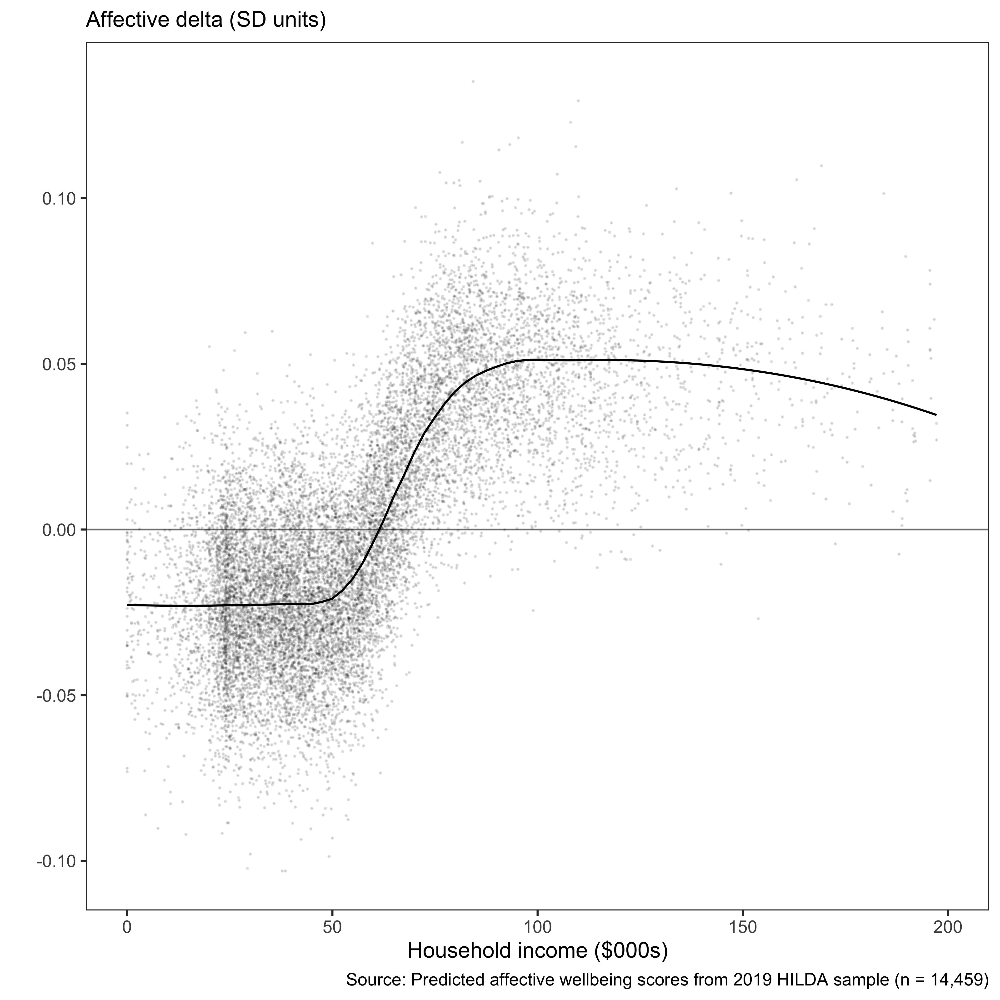

The increasing cost of happiness
================
R.W. Morris1,2, N. Kettlewell2,3,4 &
N.Glozier1,5

 

1.  Central Clinical School, Faculty of Medicine and Health, University
    of Sydney, NSW, Australia
2.  ARC Centre of Excellence for Children and Families over the Life
    Course, University of Queensland, QLD, Australia
3.  School of Economics, University of Technology, NSW, Australia
4.  Institute of Labor Economics (IZA), Bonn, Germany
5.  Brain and Mind Centre, University of Sydney, NSW, Australia

 

**Corresponding author:**

    Professor Nick Glozier  
    Faculty of Medicine and Health,   
    University of Sydney,  
    NSW 2050,  
    Australia  
    email: nick.glozier@sydney.edu.au

 

|            |                   |
| ---------- | ----------------- |
| Draft      | 15 November, 2020 |
| Word count | 3760 (max 4000)   |
| Tables     | 1                 |
| Figures    | 3                 |

   

**keywords:** Subjective wellbeing, household wealth, HILDA

 

  

# Abstract

A fundamental question for governments and people is how much happiness
does a dollar buy? The accepted view among economists and psychologists
is that money and happiness increase together up to a point, after which
there is little further gain from increasing wealth. While the location
of this change point has been determined, and the cost of happiness
reportedly ranges between USD$60 to $95K, there has been no
investigation as to whether the cost of happiness has increased or
decreased over time. We tested the relationship between household wealth
and both happiness and life satisfaction using household economic data
from Australia between 2002-2016. We discovered the cost of happiness
has increased over those 16 years faster than inflation (i.e., cost of
living). This result shows that inequalities in wealth may be driving
inequities in happiness and wellbeing, with implications for health and
recent government policy-goals to monitor and improve wellbeing.

  

  

  

  

  

  

-----

## Background

A fundamental question for psychology and economics is just how much
wellbeing does a dollar buy? Increasing wealth is commonly associated
with increasing wellbeing, however a point at which wealth no longer
increases subjective wellbeing has also been widely observed (Clark et
al., 2008; Dolan et al., 2008; Easterlin, 1974). Given that a central
goal of nations and governments is to improve wealth under the
assumption that wealth always increases wellbeing, challenges to this
notion have far reaching consequences (Frijters et al., 2020).

Subjective wellbeing is not a unitary entity (Diener et al., 2017);
studies typically distinguish between life satisfaction, the cognitive
appraisal of one’s own accomplishments, and happiness, one’s prevailing
affective state or emotional mood. Money can have different effects on
each. For instance, we have recently reported that positive life events,
such as a major financial windfall, have a greater impact on an
individual’s satisfaction than their happiness (Kettlewell et al.,
2020). While the distinct effect of wealth on satisfaction and happiness
was observed within individuals, the distinct effects of wealth have
also been observed across individuals. For instance, Kahneman & Deaton
(2010) showed that self-reported levels of happiness increased with
household wealth up to a point ($75,000). But after that, increasing
amounts of money had no further effect on happiness. They also reported
that life satisfaction continued to increase with wealth beyond $75,000.
Indeed, the difference between the two questions: “How satisfied are you
with your life?” and “How happy are you these days?” has been identified
as a crucial mediating factor in a meta-analysis of 111 studies on
wealth and wellbeing (Howell and Howell, 2008; also Veenhoven and
Hagerty, 2006). Results such as these have provided a more nuanced view
among psychologists and (some\!) economists about the relationship
between wealth and wellbeing; namely that wealth is more strongly
related to satisfaction than to happiness.

The distinction between satisfaction and happiness are increasingly
relevant to governments and policy-makers due to the growing recognition
that increasing wealth does not necessarily lead to improvements in
wellbeing (Clark, 2018; Frijters et al., 2020). If wealth no longer
improves wellbeing, then the maximization of wealth may no longer be a
legitimate goal of government. Fundamentally, the existence of a change
point between wealth and happiness reveals an unacknowledged inequality
in the distribution of wellbeing in the economy. Of concern is the point
at which wealth produces no further increases in happiness – that is,
the change point, or cost of happiness. The cost of happiness represents
the point at which material wealth stops driving inequalities in the
distribution of happiness in the economy, where lower cost-points
represent more equitable distributions of happiness. For instance,
Kahneman estimated the cost of happiness among US survey respondents in
2008 to be approximately USD75,000 per year, substantially more than the
US median income (USD52,000) in that year. Research since then has
revealed variations in the cost of happiness due to world region,
gender, and education (Jebb et al., 2018), consistent with financial
inequality driving inequities in wellbeing and happiness. However, to
date there has been no investigation of whether the cost of happiness
has changed over time. In particular has the cost, and therefore the
distribution, of happiness become more or less equitable in the last few
decades?

We used household economic panel data from Australia (HILDA) to provide
the first investigation of whether changes in wealth and wellbeing have
changed the cost of happiness over the last 16 years (2002-2018). HILDA
provides a representative sample of households in Australia with
detailed measurements of wealth and subjective wellbeing in the same
sample, which makes it an excellent data source to investigate the
present question. We distinguished between satisfaction and happiness as
different components of subjective wellbeing, and evaluated how each
varies with household wealth. After adjusting for age, gender, and
education level, we confirmed that happiness and satisfaction have
distinct relationships with increasing wealth, but the cost of happiness
has increased in real dollar terms since 2002.

 

## Methods

 

#### Wealth

Our indicator of wealth and economic security was household after-tax
income. Household income better represents economic security, since
members of the same household share expenses as well as risks; i.e.,
they can provide a direct and immediate support network when financial
shocks occur. The other major studies also used household after-tax
income as the indicator of wealth and economic security (e..g, Kahneman
and Deaton, 2010; Jebb et al., 2018), and so we follow the same standard
here as well. Household financial year disposable regular income
[(hifdip)](https://www.online.fbe.unimelb.edu.au/HILDAodd/KWCrossWaveCategoryDetails.aspx?varnt=hifdip)
from the annual HILDA survey in 2002, 2006, 2010, 2014,and 2018 was
selected. This variable in HILDA represents the sum across all household
members of financial year gross regular income less taxes on financial
year gross regular income.

Household income was provided by the University of Melbourne as imputed,
and with weighted topcodes to preserve anonymity. We removed individuals
with values above the threshold indicated for top-coding. Household
wealth was adjusted for the number of people in each household by
dividing by the square root of household size (Headey and Wooden, 2004;
Jebb et al., 2018; Kahneman and Deaton, 2010). We converted dollar
values to the base year (2002) according to CPI from the RBA, in order
to adjust for inflation
(<https://www.rba.gov.au/calculator/annualDecimal.html>).

 

#### Subjective Wellbeing

There are a variety of variables related to subjective well-being
collected annually in HILDA, but the two we used here matched the
variables we used in our previous paper (Kettlewell et al., 2020),
namely, life satisfaction as a measure of cognitive wellbeing, and the
SF-36 as a measure of affective wellbeing or happiness. Life
satisfaction
[(losat)](https://www.online.fbe.unimelb.edu.au/HILDAodd/KWCrossWaveCategoryDetails.aspx?varnt=losat)
was assessed by a single item question asked each survey: “How satisfied
are you with your life (0 to 10)”. Happiness was determined by item 9 in
the SF-36 [(gh9a to
gh9i)](https://www.online.fbe.unimelb.edu.au/HILDAodd/KWCrossWaveCategoryDetails.aspx?varnt=gh9a).
The SF-36 is a widely used self-completion measure of various aspects of
physical, emotional and mental health (Ware Jr, 2000). Item 9 consists
of nine questions relating to mental health and vitality, where five
questions deal with positive and negative aspects of mental health
(e.g., “Felt so down in the dumps nothing could cheer me up”, “Been
happy”), and four questions deal with positive and negative aspects of
vitality (e.g., “feel full of life”, “felt worn out”). Each question
referred to the past four weeks and agreement was indicated on a
six-point scale. We reverse scored the relevant responses and calculated
the sum of the nine questions so that higher scores represented better
wellbeing.

 

#### Modelling

We modelled the relationship between wealth and each wellbeing variable
(happiness and satisfaction) using a simple **linear model** and a
**piecewise model** (broken-stick). The linear model was the simplest
relationship while the piecewise model was chosen as the simplest
extension of a linear model which can identify a change point
(inflection) between wellbeing and wealth. The location of the change
point was a free parameter which revealed where wellbeing no longer
increased linearly with wealth. We then compared the linear model
against the piecewise model to determine if a change point existed in
each or any year between wealth and each wellbeing variable (see model
selection). Finally, where a change point existed, we determined the
location of the change point for that year (see change point
estimation).

*Model estimation*  
We adopted a Bayesian approach for estimating the linear and piecewise
model in the software Stan (Bürkner, 2017; Stan Development Team, 2019).
In each case,

Let \(y_i \sim N(\mu_i, \sigma^2_y)\)

The linear model was estimated as:

\[
\mu_i = \beta_0 + \beta_1 X_i 
\]

Where \(X_i\) was an individual’s household wealth ($) as well as other
covariates (age, age2, gender, education), and \(y_i\) was an
individual’s wellbeing.

 

The piecewise model was a simple extension of this to include a free
parameter to represent the changepoint in wealth (\(\omega\)) as well as
the slope after the change point (\(\beta_2\)):

\[
\mu_i = \beta_0 + \beta_1 (x_i - \omega_t) (x_i ≤ \omega_t) + \beta_2 (x_i - \omega_t) (x_i > \omega_t)
\]  

The above models estimated population-level (fixed) effects for each
year in the data (*t* = 2002, 2006, 2010, 2014 and 2018). Because we
were interested in the location of the change point between wealth and
wellbeing that existed across individuals within each year, we ignored
the panel design of HILDA because the dependency between observations of
the same person across years was orthogonal to our effects of interest.
We assumed an unstructured variance-covariance matrix between years, and
specified weakly informed priors for each *β*, and a uniform prior over
the restricted range of wealth values for *ω*.

*Model selection*  
To determine whether wellbeing was a linear or non-linear (e.g.,
piecewise) function of wealth, we compared the linear and piecewise
model posterior probabilities using the [Widely Applicable Information
Criterion
(WAIC)](https://bookdown.org/ajkurz/Statistical_Rethinking_recoded/overfitting-regularization-and-information-criteria.html#the-problem-with-parameters).
The WAIC is the log-posterior predictive density plus a penalty
proportional to the variance in the posterior distribution. Thus it
provides an approximation of the out-of-sample deviance that converges
to the cross-validation approximation in a large sample, with a penalty
for the effective number of parameters (degrees of freedom). For this
reason is it useful to compare two models of varying complexity, such as
our linear and piecewise model.

WAIC was defined as: WAIC = -2(lppd - *p*WAIC)

Where lppd (log pointwise predictive density) is the total across
observations of the log of the average likelihood of each observation,
and *p*WAIC is the effective number of free parameters
determined by the sum of the variance in log-likelihood for each
observation (*i*).

*Parameter estimation*  
To determine the location of the change point (*ω*) between wellbeing
and wealth, we modelled the relationship between wealth and wellbeing
across individuals using the piecewise model described above, and
sampled the posterior probability of *ω* over 4000 interations. The
complete posterior distribution of *ω* for each year is presented along
with the expected value (mean).

 

*Covariates*  
Age (and age2), gender, and education were included as
covariates, and fulltime students were removed. Gender was included as a
binary variable, and education was coded from the highest level of
education achieved (“less than highschool”, “highschool”, “university
graduate”, “postgraduate”).

 

## Results

For visualization purposes only, due to the large number of individual
data points in each year, we grouped individuals into 10 equal-sized
subgroups according to their wealth decile ($). Thus in each plot, the
mean wealth and mean wellbeing score for each decile is presented,
rather than each individual data point. Note that the line-of-best-fit
and 95% confidence intervals from each regression model *of all
individuals* is shown in
overlay.

 

##### Figure 1. Household wealth and satisfaction (blue) and happiness (red)

<!-- -->

    Figure 1 legend: Line-of-best-fit and 95% confidence interval (shaded) from regressions of  wellbeing on household wealth, with age, gender and education included as covariates. Wellbeing was measured as life satisfaction (blue) or happiness (red). The total number of individuals in each model are shown (n). Points represent the mean value of each wealth decile.

 

Figure 1 shows the relationship between household wealth and
satisfaction appeared relatively linear, as the results of the piecewise
regression indicated the inflection of the change point could be
increasing (e.g., 2002, 2006) as well as decreasing (e.g., 2010, 2014,
2018). By contrast, a decreasing change point was evident in each year
of happiness on wealth. The results of a formal comparison between
linear and piecewise models is provided in Model Selection below.
However note that the change point between wealth and happiness appeared
to shift rightwards over time (bottom row). (We can also see the linear
relationship between household wealth and each wellbeing variable became
slightly weaker over time, i.e., less steep)

 

#### Model Selection

We compared the posterior evidence for a linear relationship between
wellbeing and wealth with the posterior evidence of a nonlinear
(piecewise) relationship (i.e., WAIClinear —
WAICpiecewise). Thus a WAIC difference greater than zero
indicated evidence for a linear relationship. A WAIC difference less
than zero indicated evidence for a nonlinear (piecewise)
relationship.

 

##### Figure 2. Model evidence (mean difference of WAIClinear — WAICpiecewise)

<!-- -->

    Figure 2 legend: Differences in posterior evidence for a linear fit over a piecewise fit (WAIC) for satisfaction (blue) and happiness (red). The filled circle indicates the mean of the distribution and the horizontal bars represents the 90% credible interval. A difference greater than zero is support for the linear model and below zero is support for the piecewise model.

  

Model selection revealed the posterior evidence for the linear fit of
satisfaction on wealth was credibly superior to the nonlinear
(piecewise) fit - Figure 2 shows the 90% credible interval of the fit
for each year of satisfaction was above zero with no overlap. By
contrast, a nonlinear fit of happiness on wealth was generally superior,
and the nonlinear fit was credibly superior at 90% for each of three
years (2006, 2014, 2018). Thus, the posterior evidence indicates
happiness and satisfaction have distinct relationships with household
wealth; satisfaction tends to increase linearly with wealth, while a
change point exists in the relationship between happiness wealth.

 

#### Parameter Estimation

We present the complete posterior distribution of ω over 4000 samples
for each year, representing the location of the change point between
happiness and wealth. Shaded areas to the right of the vertical grey
dotted line are credibly (90%) larger than the base year
    (2002).

 

##### Figure 3. Posterior distributions of ω (mean & 90% distribution)

<!-- -->

    Figure 3 legend: Posterior distribution of the change point parameter representing the location in household wealth ($) for each year. Shaded area represents the 90% credible region.

 

Figure 3 shows the change point between happiness and household wealth
(the *cost of happiness*) credibly increased between 2002 and 2018.
Table 2 below compares the change in median and mean wealth for each
year with the cost of happiness. It also present the percentage of
people in each year whose household wealth exceeded the cost point.

 

<table>

<caption>

Table 1. Household wealth, change points and percentile

</caption>

<thead>

<tr>

<th style="text-align:left;">

year

</th>

<th style="text-align:right;">

median ($000s)

</th>

<th style="text-align:right;">

mean ($000s)

</th>

<th style="text-align:right;">

change point ($000s)

</th>

<th style="text-align:right;">

%

</th>

</tr>

</thead>

<tbody>

<tr>

<td style="text-align:left;">

fy2002

</td>

<td style="text-align:right;">

26.86

</td>

<td style="text-align:right;">

30.93

</td>

<td style="text-align:right;">

29.41

</td>

<td style="text-align:right;">

43.7

</td>

</tr>

<tr>

<td style="text-align:left;">

fy2006

</td>

<td style="text-align:right;">

38.07

</td>

<td style="text-align:right;">

43.77

</td>

<td style="text-align:right;">

41.13

</td>

<td style="text-align:right;">

44.0

</td>

</tr>

<tr>

<td style="text-align:left;">

fy2010

</td>

<td style="text-align:right;">

53.72

</td>

<td style="text-align:right;">

61.24

</td>

<td style="text-align:right;">

49.43

</td>

<td style="text-align:right;">

55.8

</td>

</tr>

<tr>

<td style="text-align:left;">

fy2014

</td>

<td style="text-align:right;">

66.62

</td>

<td style="text-align:right;">

76.81

</td>

<td style="text-align:right;">

68.85

</td>

<td style="text-align:right;">

47.7

</td>

</tr>

<tr>

<td style="text-align:left;">

fy2018

</td>

<td style="text-align:right;">

74.54

</td>

<td style="text-align:right;">

86.99

</td>

<td style="text-align:right;">

105.85

</td>

<td style="text-align:right;">

26.0

</td>

</tr>

</tbody>

</table>

 

Table 1 shows the cost of happiness increased faster than median
household wealth. As a result, a smaller percentage of people achieved a
level of wealth at which happiness no longer increased in 2018 than in
2002.

  

## Conclusions

We found the relationship between subjective wellbeing and wealth was
positive, but happiness and satisfaction had different (positive)
relationships: Satisfaction increased linearly with wealth, while
happiness increased rapidly up to a point after which further increments
in wealth produced less change – this confirms the distinct effects of
wealth in previous research (e.g., Howell and Howell, 2008; Kahneman and
Deaton, 2010), and contributes rare evidence from the same sample.
Furthermore, we report here for the first time that the change point
between wealth and happiness increased over time between 2002 and 2018,
faster than inflation or the median household income.

We refer to the change point after which increases in wealth no longer
produce similar increases in happiness as the cost of happiness. So
household wealth, and the economic security it represents, buys
happiness up to a point after which happiness and wealth are rarely
related. Satisfaction on the other hand always increased with household
wealth. The difference likely reflects the importance of a numerical
dollar value (e.g., bank balance) when cognitively appraising one’s life
achievements, versus the relevance of that number to our everyday
experience of joy and prevailing mood. However an implication of the
increasing cost of happiness over the last sixteen years is that wealth
inequality is driving increasing *inequities* in wellbeing. In 2002, the
cost point of happiness represented a 9% increase over median wealth,
while in 2018 it represented a 42% increase over median wealth. This
also represents a reduction from 44% to 26% in the proportion of people
who have achieved a level of household wealth beyond which their
happiness no longer depends. Thus over time the happiness of more
people, i.e., their everyday experience of joy and their prevailing
mood, has depended on their material wealth.

Australia has low levels of wealth disparity relative to other OECD
countries, and the Gini coefficient has not changed a great deal between
2002 and 2018 in the HILDA dataset (Commission and others, 2018). A
stable Gini coefficient shows income inequality has remained steady over
the time period, and our results do not conflict with this conclusion.
Rather what we are revealing is the effect of income inequality on
happiness has increased over the same time period. So while income
inequality has remained steady, it’s impact on wellbeing inequity has
increased. We think this highlights the issue that while traditional
measures of wealth and income inequality may not change, their impact on
wellbeing and health can still vary. As focus shifts from traditional
wealth indicators towards wellbeing measures, findings such as this may
become more prevalent.

Some recent studies have challenged either the notion that the positive
effect of money plateaus, or that the effect on happiness and
satisfaction are distinct. In a nationally representative sample of
44,000 adult Americans in the General Social Survey (GSS), happiness
continued to increase with household wealth, implying no change point
existed between money and happiness (Twenge and Cooper, 2020). The GSS
asks a single item on happiness: “Taken all together, how would you say
things are these days – would you say that you are very happy, pretty
happy, or not too happy?” The form of this question is quite similar to
the single item “life satisfaction” question in HILDA, as both request
the respondent to cognitively evaluate their circumstances. By contrast,
the nine items we selected to measure happiness covered a range of
affect and focused on current feelings: e.g., “How much of the time
during the past 4 weeks have you been a happy person?” Critical
differences in the operational definition of happiness seem likely to
explain the results observed here.

A second recent report from a survey of 1.7 million people representing
164 countries in the Gallup World Poll reported increases in household
wealth were associated with change points in happiness and satisfaction
(Jebb et al., 2018), rather than distinct effects as we found. It may be
that differences in the sparsity of the high income data in HILDA (for
which extremely high income households are masked) explain the
differences here. However including these individuals in our analysis
did not change the linear effect between wealth and satisfaction
observed here, and the weighted topcodes should have biased the result
towards a change point. We also note a linear effect between wealth and
satisfaction is consistent with the majority of earlier literature
(Howell and Howell, 2008; Stevenson and Wolfers, 2013).

As governments and policy-makers begin to focus on wellbeing, it will be
critical to understand how traditional economic indicators such as
household wealth, income inequality, and consumption interact with
wellbeing and health. According to Frijters et al. (2020), coming up
with a consensus to translate income into wellbeing features high on the
wider wellbeing research agenda. Establishing the links between income,
household wealth, wellbeing and health, and how inequalities in one
drives inequities in the other, will be a critical step in that agenda.

 

## References

Bürkner, P.-C., 2017. brms: An R package for Bayesian multilevel models
using Stan. Journal of Statistical Software 80, 1–28.
<https://doi.org/10.18637/jss.v080.i01>

Clark, A.E., 2018. Four decades of the economics of happiness: Where
next? Review of Income and Wealth 64, 245–269.

Clark, A.E., Frijters, P., Shields, M.A., 2008. Relative income,
happiness, and utility: An explanation for the easterlin paradox and
other puzzles. Journal of Economic literature 46, 95–144.

Commission, A.G.-P., others, 2018. Rising inequality? A stocktake of the
evidence. Productivity Commission Research Paper.

Diener, E., Heintzelman, S.J., Kushlev, K., Tay, L., Wirtz, D., Lutes,
L.D., Oishi, S., 2017. Findings all psychologists should know from the
new science on subjective well-being. Canadian Psychology/psychologie
canadienne 58, 87.

Dolan, P., Peasgood, T., White, M., 2008. Do we really know what makes
us happy? A review of the economic literature on the factors associated
with subjective well-being. Journal of economic psychology 29, 94–122.

Easterlin, R.A., 1974. Does economic growth improve the human lot? Some
empirical evidence, in: Nations and Households in Economic Growth.
Elsevier, pp. 89–125.

Frijters, P., Clark, A.E., Krekel, C., Layard, R., 2020. A happy choice:
Wellbeing as the goal of government. Behavioural Public Policy 4,
126–165.

Headey, B., Wooden, M., 2004. The effects of wealth and income on
subjective well-being and ill-being. Economic record 80, S24–S33.

Howell, R.T., Howell, C.J., 2008. The relation of economic status to
subjective well-being in developing countries: A meta-analysis.
Psychological bulletin 134, 536.

Jebb, A.T., Tay, L., Diener, E., Oishi, S., 2018. Happiness, income
satiation and turning points around the world. Nature Human Behaviour 2,
33–38.

Kahneman, D., Deaton, A., 2010. High income improves evaluation of life
but not emotional well-being. Proceedings of the national academy of
sciences 107, 16489–16493.

Kettlewell, N., Morris, R.W., Ho, N., Cobb-Clark, D.A., Cripps, S.,
Glozier, N., 2020. The differential impact of major life events on
cognitive and affective wellbeing. SSM-population health 10, 100533.

Stan Development Team, 2019. RStan: The R interface to Stan.

Stevenson, B., Wolfers, J., 2013. Subjective well-being and income: Is
there any evidence of satiation? American Economic Review 103, 598–604.

Twenge, J.M., Cooper, A.B., 2020. The expanding class divide in
happiness in the united states, 1972–2016. Emotion.

Veenhoven, R., Hagerty, M., 2006. Rising happiness in nations 1946–2004:
A reply to easterlin. Social indicators research 79, 421–436.

Ware Jr, J.E., 2000. SF-36 health survey update. Spine 25, 3130–3139.

