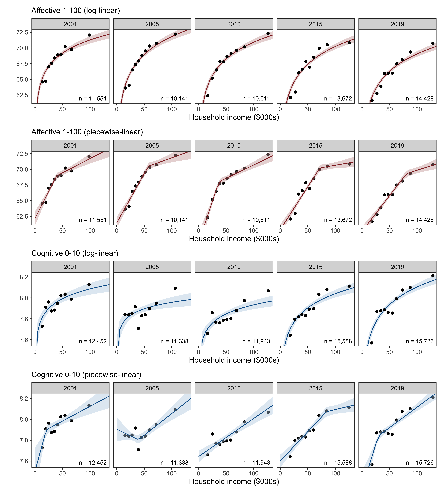

The increasing cost of happiness
================
R.W. Morris1,2, N. Kettlewell2,3,4 &
N.Glozier1,5

 

1.  Central Clinical School, Faculty of Medicine and Health, University
    of Sydney, NSW, Australia
2.  ARC Centre of Excellence for Children and Families over the Life
    Course
3.  School of Economics, University of Technology, NSW, Australia
4.  Institute of Labor Economics (IZA), Bonn, Germany

 

**Corresponding author:**

    Professor Nick Glozier  
    Faculty of Medicine and Health,   
    University of Sydney,  
    NSW 2050,  
    Australia  
    email: nick.glozier@sydney.edu.au

 

|         |                |
|---------|----------------|
| Draft   | 12 March, 2021 |
| Words   | 4395           |
| Tables  | 0              |
| Figures | 4              |

   

**keywords:** Subjective wellbeing, household income, HILDA

 

  

# Abstract

A fundamental question for society is how much happiness does a dollar
buy? The accepted view is that income and happiness increase together up
to a point, after which there is little further gain from increasing
wealth. While the location of this change point reportedly ranges
between USD$60K to $95K, there has been no investigation as to whether
this has increased or decreased over time. We determined the change over
time in the relationship between income and both affective wellbeing
(happiness), and cognitive wellbeing (life satisfaction), using
household economic data from Australia between 2001-2019. The change
point in the slope between happiness and income has increased over those
19 years faster than the cost of living, but the association of life
satisfaction with income has remained linear. As a result, the happiness
of a larger proportion of the population is more dependent on
differences in income, despite stable differences in income distribution
(e.g., Gini coefficient) in that time. This suggests that inequalities
in income may be driving increasing inequities in happiness between the
rich and the poor, with implications for health and recent government
policy-goals to monitor and improve wellbeing.

  

  

  

  

  

  

  

  

## Significance Statement

Income has decreasing returns on happiness, across countries, cultures
and ethnicities, with an inflection or change point near USD75,000.
Below this point, happiness is relatively dependent on income levels;
revealing an inequity in the distribution of happiness between rich and
poor. We do not know whether or how this point changes over time. Has it
decreased and reduced inequity, or increased the difference between the
rich and poor? We examine 19 years of data from Australia and determine
that the income level at which happiness becomes less influenced by
income has increased, relative to the cost of living. The happiness of
an increasing proportion of the population is more dependent on their
financial security than ever this millennium. (120 max)

  

## Background

A fundamental question for governments and people is just how much
wellbeing does a dollar buy? Increasing income is commonly associated
with increasing happiness and subjective wellbeing, however a point at
which subjective wellbeing no longer increases with income has also been
widely observed (Clark et al., 2008; Dolan et al., 2008; Easterlin,
1974). Given that a central goal of nations and governments is to
improve income under the assumption that higher income always increases
wellbeing, challenges to this notion have far reaching consequences
(Frijters et al., 2020; Laws and Monitor, 2014).

Subjective wellbeing is not a unitary entity (Diener et al., 2017);
studies typically distinguish between life satisfaction, the cognitive
appraisal of one’s own accomplishments, and affective wellbeing, one’s
prevailing affective state, emotional mood, or everyday experience of
happiness. Money can have different effects on each. For instance, we
have recently reported that large increases in wealth, such as a major
financial windfall, have a greater impact on an individual’s life
satisfaction than their happiness (Kettlewell et al., 2020). The
distinct effect of money on satisfaction and happiness was observed
within individuals over time, however a distinct effect of income has
also been observed between people with different income levels. For
instance, Kahneman & Deaton (2010) showed that self-reported levels of
happiness increased with household income up to a point (USD75,000), but
after that, increasing income had little further effect on happiness.
Conversely life satisfaction continued to increase with income beyond
USD75,000. Indeed, the difference between the two questions: “How
satisfied are you with your life?” and “How happy are you these days?”
has been identified as a crucial mediating factor in a meta-analysis of
111 studies on income and wellbeing (Howell and Howell, 2008; also
Veenhoven and Hagerty, 2006). Larger and newer data sets now also
suggest that higher incomes are associated with more happiness and life
satisfaction both within and across nations (Jebb et al., 2018;
Killingsworth, 2021; Sacks et al., 2012). Results such as these have
provided a more nuanced view of the relationship between income and
wellbeing; namely that while both happiness and satisfaction continue to
increase with income, the happiness returns are decreasing (Diener et
al., 2010; Haushofer and Fehr, 2014).

Fundamentally, the existence of a change point in the relationship
between income and happiness reveals an unacknowledged source of
inequality in the distribution of wellbeing (i.e., happiness) in the
economy. For instance, the change point of USD75,000 reported by
Kahneman in 2008 was substantially more than the US median income of
USD52,000 in the same year, indicating that the happiness of the poorest
majority of the US population was tied to marginal changes in income
while the happiness of a richer minority was not. Thus the change point
represents the dollar value up to which income drives inequities in the
distribution of happiness, such that a lower valued change point
represents a more equitable distribution of happiness in the economy.
Inequities in the distribution of wellbeing are increasingly relevant to
governments and policy-makers due to the growing recognition that
increasing income does not necessarily lead to equal changes in
wellbeing (Clark, 2018; Frijters et al., 2020). Even prior to COVID-19,
the World Gallup Poll has observed that happiness has been decreasing
over the past decade in western Europe, North America, Australia and New
Zealand, despite increases in income in the same countries (Sachs et
al., 2019). However to date there has been no investigation of whether
the relationship between income and happiness has changed over time
which may contribute to these social trends. In particular has the
change point between income and happiness increased or decreased, and
therefore the distribution of happiness between rich and poor, become
more or less equitable in the last two decades?

 

## Methods

We used household economic panel data from Australia to provide the
first investigation of whether changes in income and wellbeing have
shifted the change point between 2001 to 2019. Australia is a developed
western nation that has experienced a relatively stable period of
economic growth in the last 19 years, which makes it a good candidate to
observe how the function between income and subjective wellbeing has
evolved over time without major economic shocks. HILDA (the Household,
Income, and Labour Dynamics in Australia survey) provides a
representative sample of households in Australia with detailed
measurements of income and subjective wellbeing each year, which makes
it an excellent data source to investigate the present question. We
distinguished between satisfaction and happiness as different components
of subjective wellbeing, and evaluated how each varied with household
income over time using piecewise linear regression to determine the
change points in each year.

 

#### Income

To allow comparison with other major studies of income and wellbeing we
used household after-tax income as the indicator of income and economic
security (e..g, Kahneman and Deaton, 2010). Household income better
represents economic security than personal income, since members of the
same household share expenses as well as risks; i.e., they can provide a
direct and immediate support network when financial shocks occur, which
a priori might affect wellbeing. The ‘real household annual disposable
income’ was calculated from the self-reported combined income of all
household members after receipt of government pensions and benefits and
deduction of income taxes in the financial year ended 30th June of the
year of the wave (e.g., 2001 in wave 1). This was then adjusted for
inflation - the rise in the general price level of the economy - using
the Australian Bureau of Statistics (ABS) Consumer Price Index, so that
income in all waves is expressed in 2019 prices, to give real income.

The *equivalised* household income was obtained by adjusting for
household size (the number of adult and child household members). We
used the ‘modified OECD’ scale (Hagenaars et al., 1994), which divides
household income by 1 for the first household member plus 0.5 for each
other household member aged 15 or over, plus 0.3 for each child under
15. A family comprising two adults and two children under 15 years of
age would therefore have an equivalence scale of 2.1 (1 + 0.5 + 0.3 +
0.3), meaning that the family would need to have an income 2.1 times
that of a single-person household in order to achieve the same standard
of living. This scale recognises that larger households require more
income, but it also recognises that there are economies of scale in
consumption and that children require less than adults. The equivalised
income calculated for a household is then assigned to each member of the
household.

 

#### Subjective Wellbeing

There are a variety of variables related to subjective well-being
collected annually in HILDA, but the two we used here matched the
variables we used in our previous paper (Kettlewell et al., 2020),
namely, life satisfaction as a measure of cognitive wellbeing, and item
9 from the SF-36 (9a-9i) as a measure of affective wellbeing or
happiness.

Life satisfaction
<a href="https://www.online.fbe.unimelb.edu.au/HILDAodd/KWCrossWaveCategoryDetails.aspx?varnt=losat" target="_blank">(losat)</a>
was assessed by a single item question asked each survey: “All things
considered, how satisfied are you with your life (0 to 10).”

Happiness was determined by 9 questions in the SF-36
<a href="https://www.online.fbe.unimelb.edu.au/HILDAodd/KWCrossWaveCategoryDetails.aspx?varnt=gh9a" target="_blank">(9a to 9i)</a>.
The SF-36 is a widely used self-completion measure of various aspects of
physical, emotional and mental health (Ware Jr, 2000). A subset of 9
questions assess mental health and vitality, with five questions
measuring positive and negative aspects of mental health (e.g., “Felt so
down in the dumps nothing could cheer me up,” “Been happy”), and four
questions on positive and negative aspects of vitality (e.g., “feel full
of life,” “felt worn out”). The response scale timeframe is the past
four weeks and agreement was indicated on a six-point Likert scale. We
reverse scored negatively phrased questions and calculated the sum of
the nine questions so that higher scores represented better wellbeing.
To aid interpretability, we rescaled the final sum to a score between
1-100, where 100 represents the maximum happiness achievable.

 

#### Modelling

We modelled the relationship between income and each wellbeing variable
(happiness and satisfaction) using a simple linear model and a piecewise
model with a single change-point. The piecewise model was chosen as the
simplest extension of a linear model which can identify a change point
(inflection) in the relationship between wellbeing and income. The
location of the change point was a free parameter which revealed where
wellbeing no longer increased at a uniform rate with income. We then
compared the linear model against the piecewise model to determine if a
change point existed in any year between household income and each
wellbeing variable (see Model Selection). Finally, where a change point
existed, we determined the location of the change point for that year
(see Parameter Estimation).

For modelling, both measures of wellbeing and income were rescaled with
a mean of zero and a SD of 1 (z-scores) for each year.

*Model Design*  
We adopted a Bayesian approach for estimating the linear and piecewise
model in the software Stan (Bürkner, 2017; Stan Development Team, 2019).
In each case the linear model was estimated as:

*y**i* ∼ *N*(*μ**i*, *σ**y*2)

*μ**i* = *β*0 + *β*1*X**i*

Where *X**i* was an individual’s household income ($) as well
as other covariates (age, age2, sex, education, chronic
illness), and *y**i* was an individual’s wellbeing.

 

The piecewise model was a simple extension of this to include a free
parameter to represent the changepoint in income (*ω*) as well as the
slope before the change point (*β*1) and the slope after the
change point (*β*2):

*μ**i* = *β*0 + *β*1(*x**i* − *ω*)(*x**i* ≤ *ω*) + *β*2(*x**i* − *ω*)(*x**i* &gt; *ω*) + *β*3*X**i*

Where *x**i* was an individual’s household income, and
*X**i* were the cross-sectional HILDA population weights to
adjust for differences in the sample representativeness according to sex
by broad age, marital status, region, and labour force status.

 

The above models estimated population-level effects separately for each
year (*t* = 2001…2019). Because we were interested in the location of
the change point between income and wellbeing that existed across
individuals within each year, we ignored the panel design of HILDA
because the dependency between observations of the same person across
years was orthogonal to our effects of interest.

The parameters of the piecewise model used Gaussian priors centred at
zero, with a regularized parameterization for the slopes and intercept
of Normal(0, 0.1) for each *β* prior, and a slightly less restrictive
regularization for the change point prior Normal(0, 0.5). These
regularizing priors were selected to reduce overfitting while still
allowing the model to learn the regular features of the sample, and so
provide a more robust population estimate. They are skeptical priors and
a prior predictive check confirmed they assume no relationship between
income and wellbeing, with no difference in gradient before or after the
change point (Supplementary materials, Figure S4).

*Model Selection*  
To determine whether wellbeing was a linear or non-linear (e.g.,
piecewise) function of income, we compared the out-of-sample deviance of
the linear and piecewise model fits using the
<a href="https://bookdown.org/ajkurz/Statistical_Rethinking_recoded/overfitting-regularization-and-information-criteria.html#the-problem-with-parameters" target="_blank">Widely Applicable Information Criterion (WAIC)</a>.
The WAIC is the log-posterior predictive density plus a penalty
proportional to the variance in the posterior distribution, so it
represents an approximation of the out-of-sample deviance that converges
to the cross-validation accuracy in a large sample, with a penalty for
the effective number of parameters (degrees of freedom). Thus using the
out-of-sample deviance for model selection in combination with
regularizing priors in our model design is a dual strategy to reduce
overfitting and penalize overfitting. This makes it a useful approach
for comparing models of varying complexity, such as our linear and
piecewise (nonlinear) models. As with other deviance metrics, smaller
negative WAIC values are better (i.e., indicate more accuracy).

WAIC was defined as: WAIC = -2(lppd - *p*WAIC)

Where lppd (log pointwise predictive density) is the total across
observations of the log of the average likelihood of each observation,
and *p*WAIC is the effective number of free parameters
determined by the sum of the variance in log-likelihood for each
observation (*i*).

*Parameter Estimation*  
To determine the location of the change point (*ω*) between wellbeing
and income, we modelled the relationship between income and wellbeing
across individuals using the piecewise model described above, and
sampled the posterior probability of *ω* over 4000 interations. The
complete posterior distribution of *ω* for each year is presented along
with the expected value (mean).

 

*Covariates*  
Cross-sectional population weights for Australia provided by the
University of Melbourne for each year were included as a covariate to
adjust for differences in the sample representativeness. Full-time
students were removed, as well as individuals with an annual household
disposable income that was negative or indicated as *topcoded* by the
University of Melbourne.

 

## Results

The broad demographic characteristics of the sample are presented in
Supplementary Materials Table S1. Household income and average life
satisfaction levels increased between 2001-2019, while average happiness
scores decreased slightly over the 19 years. The proportions of each sex
and couples were stable over time, as were the average household size
and SEIFA index. However age, education, and chronic health conditions
tended to slightly increase over time. For instance, average age
increased by 2.3 years over the 19 years of the survey, which is
obviously less than would occur in a cohort study (Watson and Wooden,
2012). Changes in the workforce varied with economic circumstances.

#### Happiness and satisfaction have distinct relationships with income

The relationship between household income and happiness (red) and
satisfaction (blue) every four years is shown in Figure 1. For each
wellbeing variable we show the results of a linear fit (rows 1 and 3)
and a piecewise fit (rows 2 and 4). For visualization purposes only, we
display the mean levels of income and wellbeing for each (equal-sized)
income decile, whereas the line-of-best-fit and 95% credible intervals
(shaded) in each regression model are derived from the underlying
*individual* data-points.

 

##### Figure 1. Household income and happiness (red) and satisfaction (blue)

<!-- -->

    Figure 1 legend: The relationship between income and wellbeing across equal-sized income deciles, overlaid by regression lines from linear and piecewise models (±95%CI). Wellbeing was measured as happiness (red) or life satisfaction (blue). The total number of individuals contributing to each regression in each year are noted (n).

 

The nonlinear relationship between happiness and income (Figure 1, 2nd
row) was consistently and negatively inflected (happiness increased less
with income after the change point). By contrast the nonlinear
relationship between satisfaction and income shown in the 4th row
exhibited negative inflection (2001, 2015, 2019), positive inflection
(2005), and no apparent inflection (2010).

The evidence from model selection revealed the nonlinear (piecewise) fit
of *happiness*, but not *satisfaction*, was superior to a linear fit in
each year (Supplementary Materials, Figure S1). The WAIC difference
indicated the piecewise fit of happiness had reliably less deviance than
the linear fit, indicating the piecewise model predicted happiness from
income more accurately using this out-of-sample metric. Overall the
model comparison suggested that happiness and satisfaction have distinct
relationships with household income; satisfaction tends to increase
linearly with income, while a change point exists in the relationship
between happiness and household income.

  

#### Temporal trends in the association between income and happiness 2001-2019

Figure 2 below presents the posterior distribution of each parameter
from the piecewise model regressing happiness on income: the change
point (ω), the intercept (β0), the pre-change point slope
(β1), and the post-change point slope (β2). Over
4,000 samples were drawn from each piecewise model to determine the
posterior distribution of each parameter (smallest bulk effective sample
size = 661, see Table S2 for the complete fit statistics in
Supplementary materials). Horizontal bars represent the 95% credible
interval of the posterior distribution and so intervals which fall
completely to the right of the vertical grey dotted line are credibly
higher than the expected value of our base year, 2001.

 

##### Figure 2. Posterior parameters of the happiness \~ income piecewise model (real 2019 dollars)

<!-- -->

    Figure 2 legend: Posterior distributions of the change point parameter representing the location in real household income (real 2019 dollars), as well as the intercept, pre-slope and post-slope parameters in SD units (happiness). Horizontal bar represents the 95% credible region and the solid point indicates the expected value (median) of each distribution. Vertical dotted line indicates the 2001 expected value (median) as a base year comparison.

 

The posterior estimates of the change point in the association between
happiness and household income indicates that the probable location
(i.e., the real income value) of the change point shows a systematic
increasing trend since 2001. Changes to the other parameters of the
function between income and happiness also occurred between 2001 and
2019 (i.e., the pre-slope, post-slope and intercept), but did not show
any sustained trend over the period.

Both the pre-slope and post-slope parameters (β1 and
β2) were credibly larger than zero in each year, indicating
there was a reliable dependency between happiness and income at income
levels both below and above the change point. However the pre-slope
parameter was in general four to five times greater than the post-slope
values, indicating that the relationship between happiness and income
among people in lower income households was an order of magnitude
stronger than those in high income households.

Changes in the other demographic variables (e.g., age, education levels
and chronic illness) did not materially alter the trends just described.
The parameters of conditional piecewise models which included age,
age2, education, and illness as covariates are compared in
Supplementary materials (Figure S2).

The change in parameter values between 2001 to 2019 indicates the
relationship between happiness and income has evolved over time. We
determined the impact of this evolution on the distribution of happiness
over the range of household income in 2019 in a counterfactual analysis.
The counterfactual analysis is a hypothetical demonstration of how
happiness would change if people in 2019 were subject to the function
that existed in 2001, i.e., would happiness increase or decrease if the
2001 function was in place in 2019? This controls for changes in the
sample which occur over time that are not related to happiness but could
nevertheless contribute to changes in the distribution of happiness. For
example, an increase in the range of (real) income levels in the economy
between 2001 and 2019 could produce an increasing gap in happiness
between the rich and poor - even with a stable relationship between
income and happiness. Such changes in the sample characteristics may
mask or confound the impact of the change point on the distribution of
happiness without careful control. Because we were interested in the
implications of the evolution of the function rather than changes in our
sample characteristics *per se*, we estimated happiness levels for each
person in 2019 (*n* = 14,459) using the 2001 function. These 2001
model-estimates were compared to (subtracted from) the 2019
model-estimates generated from the same sample (*n* = 14,459), to obtain
the change (delta) in happiness for each person under the
counterfactual. This delta is attributable to the evolution of the
function between 2001 and 2019. Figure 3 below presents the 14,459
deltas from such a comparison, along with a smoothed mean (solid line)
to summarize how the distribution of happiness evolved across the income
range.

##### Figure 3. Counterfactual difference in happiness between 2019 and 2001 for a given level of income

<!-- -->

    Figure 3 legend: The difference (∆) in predicted happiness between 2019 and 2001 for the same n = 14,459 individuals from the 2019 survey. Values below zero on the y-axis indicate lower happiness predictions using the 2019 model compared to using the 2001 model. Solid line overlay represents the (loess) smoothed average delta over the income distribution. Variance in these posterior samples is from the sample weights, uncertainty in the model parameters as well as observation-level (residual) variance.  

 

Figure 3 shows that, on average, predicted happiness is higher for
people with household incomes above $50K under the 2019 function, when
compared to the function from 2001. This is indicated by the average
delta (solid line) falling above zero on the right side of the plot.
Conversely, people with household incomes below $50K, on average, had a
decrease in predicted happiness under the 2019 function compared to 2001
function. Of course the obtained deltas are due to changes in all the
parameters of the function, including the slope before and after the
change point. However because this comparison was performed on the same
individuals from the 2019 survey, it held characteristics such as age,
income, etc, constant that would otherwise be expected to change over
time and possibly contribute to any difference in happiness
distribution. In this way these results isolate the amount of change
entirely due to the *evolution* of the function between 2001 and 2019,
and demonstrates how this has contributed to a more unequal distribution
of happiness between the rich and the poor over time in Australia.

  

#### The increasing cost of happiness in Australia

Any increase in the change point is likely to reduce the number of
people who fall above it over time if this is greater than any increase
in median income; i.e., over time a larger proportion of the
population’s happiness is responsive to marginal changes in their income
than previously. Figure 4 presents median household income levels
weighted for the Australian population (by age, sex, marital status,
labour force participation and geographical region). This shows the
change point between income and happiness increased faster than rises in
median household income between 2001 and 2019. The third panel shows
that as a result, a smaller proportion of the Australian population in
2019 had a household income above the changepoint than in 2001.

##### Figure 4. Rise in median income, change point, and population in Australia 2001-2019

<!-- -->

    Figure 4 legend: Real household income has stagnated in Australia since 2009 (post GFC) while the change point between happiness and income has increased.  

  

## Conclusions

This analysis of the Australian population since the millennium confirms
previous findings (e.g., Howell and Howell, 2008; Kahneman and Deaton,
2010), that the relationship between the two types of subjective
wellbeing and household income was positive but quite different:
Satisfaction increased linearly with income, while happiness increased
relatively steeply up to a point after which higher levels of income
were associated with much more modest differences. We refer to the
change point after which increases in income correspond to smaller
increases in happiness as the *cost of happiness*. After this point,
happiness is no longer as responsive to differences in household income,
and the economic security it represents. Presumably after this point
further increases in happiness depend more on other life factors (e.g.,
leisure time, social connections) than financial security. Our novel
finding was that this change point in the relationship between household
income and happiness increased faster than both inflation and median
household income between 2001 and 2019. For the first time we have shown
there has been a temporal shift in the change point between income and
happiness over the 19 year period, such that happiness of an increasing
proportion of the population has become more responsive to differences
in income - especially the poor and middle-income earners.

Life satisfaction on the other hand appeared to show consistent
increases with household income and we found no evidence of any change
point. The difference may reflect the importance of a numerical dollar
value (e.g., bank balance, house value) when cognitively appraising
one’s life achievements, versus the relevance of that number to our
everyday experience of joy and our prevailing mood.

An implication of the changing relationship between happiness and income
is that income inequality may be driving increasing inequities in
wellbeing. This is demonstrated in Figure 3, where the difference in
predicted happiness between 2001 and 2019 increased for incomes above
$50K/year and decreased for incomes below that level (see also Figure S6
in Supplementary materials). The inequity was also highlighted in Figure
4 where the change point of happiness represented a 9% increase over
median income in 2001, while in 2019 it represented a 42% increase over
median income. This increase relative to median income also represented
a reduction from 43% to 26% in the proportion of people whose income
fell above the changepoint. Thus we can see that over the last nineteen
years the difference in income-related happiness between the rich and
the poor has increased; while the happiness of an increasing proportion
of people, including the middle-class, is more dependent on their
financial security.

Australia has low levels of income disparity relative to many other OECD
countries, and the Gini coefficient has changed little between 2001 and
2019 (APC, 2018), suggesting income inequality has remained steady over
this time period. Our results do not conflict with this conclusion.
Rather we are revealing that even a static income distribution may have
dynamic effects on happiness over time. This highlights the issue that
while traditional univariate measures of wealth and income inequality
may be relatively stable and exhibit little change, their impact on
wellbeing and health can still vary. As such, these results may well
have relevance to other developed nations in North America and Europe
which also enjoy low levels of income inequality, but have stagnating
incomes, and declining happiness levels (Sachs et al., 2019). As focus
shifts from traditional financial indicators towards health and
wellbeing measures, findings such as this may become more prevalent.

The relationship between happiness and income is often described as
log-linear (e.g., Kahneman and Deaton, 2010; Killingsworth, 2021). Under
this view, similar proportional changes in income produce similar
evaluations of satisfaction or happiness, rather than the absolute
change. Likewise, the piecewise model reported here has a slope that
reduces with income, albeit with a single identifiable change-point
rather than a smooth curve. However our main thesis is not committed to
a function with a single or smooth changepoint; only that the slope
between income and happiness is unequal at different levels of income,
and the function is shifting to the right over time (e.g., Figure 2).
The choice between functions is somewhat arbitrary, since a log-linear
function is as easily consistent with our thesis as the piecewise
function we describe. Nevertheless, the model evidence favoured a
piecewise- over a log-linear function in a supplementary analysis
(Figure S3), which supports our model choice here.

Some recent studies have challenged the notion that the positive effect
of income plateaus after some level (“satiety”) (Killingsworth, 2021;
Stevenson and Wolfers, 2013; Twenge and Cooper, 2020). Our results also
do not support a “satiety” point or flat gradient between income and
happiness, as the average post-change slope between 2001-2019 was
reliably above zero. The pre-change slope however was also four to five
times greater than that, and we argue this difference in slopes
indicates a previously unacknowledged inequity in the distribution of
happiness between the rich and poor.

While the amount of variance in happiness explained by household income
is small (Table S4, Supplementary materials), the slope is reliably
above zero and small changes in happiness over an entire population will
aggregate. Moreover, financial gains have one of the largest impacts on
individual happiness in within-subject models (e.g., fixed-effects),
second only to marriage by our estimate (Kettlewell et al., 2020), and
there are many reasons why cross-sectional estimates of the covariance
would under-represent this. Finally, happiness is measured on a
subjective scale, where small changes at different points on the scale
may represent a large change in some other functional/real-world outcome
(e.g., risk of suicide). Ultimately, the real-world impact of small
changes in a subjective measure such as happiness is inherently
difficult to determine. Our aim here was to determine whether the
relationship between income and happiness is changing at all, and
whether this may be contributing to increasing inequity, and our results
indicate this is the case.

As governments and policy-makers begin to focus on wellbeing, it will be
critical to understand how traditional economic indicators such as
household income, wealth inequality, and consumption interact with
wellbeing and health. According to Frijters et al. (2020), coming up
with a consensus to translate income into wellbeing features high on the
wider wellbeing research agenda. Establishing the links between wealth,
household income, wellbeing and health, and how inequalities in one
drives inequities in the other, will be a critical step in that agenda.

  

## Acknowledgements

This research was not supported by any funding.

  

## Author contributions

RWM designed the analysis, analysed the data and wrote the paper. NK
designed the analysis and wrote the paper. NG proposed the idea, planned
the analysis, and wrote the paper.

  

## Competing interests

The authors declare no competing interests.

  

## Additional information

This paper uses unit record data from Household, Income and Labour
Dynamics in Australia Survey
[HILDA](https://melbourneinstitute.unimelb.edu.au/hilda) conducted by
the Australian Government Department of Social Services (DSS). The
findings and views reported in this paper, however, are those of the
author\[s\] and should not be attributed to the Australian Government,
DSS, or any of DSS’ contractors or partners. All code and scripts used
in the analysis are available at
<https://github.com/datarichard/The-increasing-cost-of-happiness>

Supplementary information is available
[online](https://datarichard.github.io/The-increasing-cost-of-happiness/supplementary.html).

  

## References

APC, 2018. Rising inequality? A stocktake of the evidence. Australian
Productivity Commission (APC) Research Paper, Canberra.

Bürkner, P.-C., 2017. brms: An R package for
Bayesian multilevel models using Stan. Journal of Statistical Software
80, 1–28. <https://doi.org/10.18637/jss.v080.i01>

Clark, A.E., 2018. Four decades of the economics of happiness: Where
next? Review of Income and Wealth 64, 245–269.

Clark, A.E., Frijters, P., Shields, M.A., 2008. Relative income,
happiness, and utility: An explanation for the easterlin paradox and
other puzzles. Journal of Economic literature 46, 95–144.

Diener, E., Heintzelman, S.J., Kushlev, K., Tay, L., Wirtz, D., Lutes,
L.D., Oishi, S., 2017. Findings all psychologists should know from the
new science on subjective well-being. Canadian Psychology/psychologie
canadienne 58, 87.

Diener, E., Ng, W., Harter, J., Arora, R., 2010. Wealth and happiness
across the world: Material prosperity predicts life evaluation, whereas
psychosocial prosperity predicts positive feeling. Journal of
personality and social psychology 99, 52.

Dolan, P., Peasgood, T., White, M., 2008. Do we really know what makes
us happy? A review of the economic literature on the factors associated
with subjective well-being. Journal of economic psychology 29, 94–122.

Easterlin, R.A., 1974. Does economic growth improve the human lot? Some
empirical evidence, in: Nations and Households in Economic Growth.
Elsevier, pp. 89–125.

Frijters, P., Clark, A.E., Krekel, C., Layard, R., 2020. A happy choice:
Wellbeing as the goal of government. Behavioural Public Policy 4,
126–165.

Hagenaars, A.J., De Vos, K., Asghar Zaidi, M., others, 1994. Poverty
statistics in the late 1980s: Research based on micro-data.

Haushofer, J., Fehr, E., 2014. On the psychology of poverty. science
344, 862–867.

Howell, R.T., Howell, C.J., 2008. The relation of economic status to
subjective well-being in developing countries: A meta-analysis.
Psychological bulletin 134, 536.

Jebb, A.T., Tay, L., Diener, E., Oishi, S., 2018. Happiness, income
satiation and turning points around the world. Nature Human Behaviour 2,
33–38.

Kahneman, D., Deaton, A., 2010. High income improves evaluation of life
but not emotional well-being. Proceedings of the national academy of
sciences 107, 16489–16493.

Kettlewell, N., Morris, R.W., Ho, N., Cobb-Clark, D.A., Cripps, S.,
Glozier, N., 2020. The differential impact of major life events on
cognitive and affective wellbeing. SSM-population health 10, 100533.

Killingsworth, M.A., 2021. Proceedings of the National Academy of
Sciences 118.

Laws, R., Monitor, F., 2014. World economic outlook, april 2014:
Recovery strengthens, remains uneven. World Economic Outlook.

Sachs, J.D., Layard, R., Helliwell, J.F., others, 2019. World happiness
report 2019.

Sacks, D.W., Stevenson, B., Wolfers, J., 2012. The new stylized facts
about income and subjective well-being. Emotion 12, 1181.

Stan Development Team, 2019. RStan: The R interface to Stan.

Stevenson, B., Wolfers, J., 2013. Subjective well-being and income: Is
there any evidence of satiation? American Economic Review 103, 598–604.

Twenge, J.M., Cooper, A.B., 2020. The expanding class divide in
happiness in the united states, 1972–2016. Emotion.

Veenhoven, R., Hagerty, M., 2006. Rising happiness in nations 1946–2004:
A reply to easterlin. Social indicators research 79, 421–436.

Ware Jr, J.E., 2000. SF-36 health survey update. Spine 25, 3130–3139.

Watson, N., Wooden, M.P., 2012. The HILDA survey: A case study in the
design and development of a successful household panel survey.
Longitudinal and Life Course Studies 3, 369–381.

