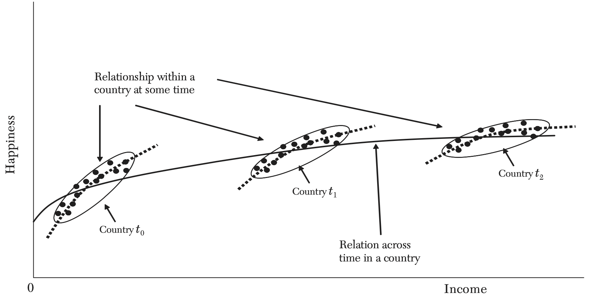

```{r setup, include=FALSE}
knitr::opts_chunk$set(echo = FALSE,
                      message = FALSE,
                      warning = FALSE,
                      fig.path = "../figures/")
library(tidyverse)
```
***
<br>

Clark, A. E., Frijters, P., & Shields, M. A. (2008). Relative income, happiness, and utility: An explanation for the Easterlin paradox and other puzzles. *Journal of Economic literature, 46*(1), 95-144.  

<br>

*Figure 4.* The Relationship between Income and Happiness at the Individual and the Aggregate Level  




<br><br>

##### Household wealth and happiness (HILDA 2002-2018)  

```{r plot_gh9}
happywealth <- read_rds("../results/happywealth.rds")

happywealth %>%
  select(xwaveid, year, 
         # swb = enexpr(swb_col), dollars = enexpr(dollars_col)) %>%
         swb = gh9, dollars = hifdip) %>%
  filter(swb >= 0) %>%
  filter(dollars >= 0) %>%
  filter(year %in% c(2002, 2010, 2018)) %>%
  mutate(year = as.factor(year)) -> df

df %>%
  group_by(year) %>%
  mutate(
    dollar_bin = ntile(dollars, 10)
  ) %>%
  group_by(year, dollar_bin) %>%
  summarize(
    wellbeing = mean(swb, na.rm=T),
    wealth = mean(dollars, na.rm=T)/1000,
    n = n()
  ) -> df.summary

df.summary %>%
  transmute(
    wealth = mean(wealth),
    wellbeing = mean(wellbeing)
  ) %>%
  distinct() -> df.summary.year

# piecewise model
ggplot(df.summary, aes(x = wealth, y = wellbeing)) +
  geom_point(aes(color = year)) +
  geom_smooth(aes(color = year), 
              method = "lm", formula = y ~ splines::bs(x, df = 2, degree = 1),
              # method = "lm", formula = y ~ log(1/(x+1)),
              linetype = 2,
              size = .5,
              se=F) +
  geom_smooth(data = df.summary.year, 
              method = "lm", formula = y ~ log(1/(x+1)), 
              color = "black",
              se=F) + 
  # scale_x_continuous(breaks = c(10, 30, 100, 300), trans = "log") +
  theme_test() +
  labs(subtitle = "SF-36 item 9 (summed)", 
       y = "", x = "household wealth ($000s)")
```

<br><br>

##### Household wealth and life satisfaction (HILDA 2002-2018)  

```{r plot_losat}
happywealth %>%
  select(xwaveid, year, 
         # swb = enexpr(swb_col), dollars = enexpr(dollars_col)) %>%
         swb = losat, dollars = hifdip) %>%
  filter(swb >= 0) %>%
  filter(dollars >= 0) %>%
  filter(year %in% c(2002, 2010, 2018)) %>%
  mutate(year = as.factor(year)) -> df

df %>%
  group_by(year) %>%
  mutate(
    dollar_bin = ntile(dollars, 10)
  ) %>%
  group_by(year, dollar_bin) %>%
  summarize(
    wellbeing = mean(swb, na.rm=T),
    wealth = mean(dollars, na.rm=T)/1000,
    n = n()
  ) -> df.summary

df.summary %>%
  transmute(
    wealth = mean(wealth),
    wellbeing = mean(wellbeing)
  ) %>%
  distinct() -> df.summary.year

# piecewise model
ggplot(df.summary, aes(x = wealth, y = wellbeing)) +
  geom_point(aes(color = year)) +
  geom_smooth(aes(color = year), 
              method = "lm", formula = y ~ splines::bs(x, df = 2, degree = 1),
              # method = "lm", formula = y ~ log(1/(x+1)),
              linetype = 2,
              size = .5,
              se=F) +
  geom_smooth(data = df.summary.year, 
              method = "lm", formula = y ~ log(1/(x+1)), 
              color = "black",
              se=F) + 
  # scale_x_continuous(breaks = c(10, 30, 100, 300), trans = "log") +
  theme_test() +
  labs(subtitle = "'All things considered, how satisfied are you with your life?' (0-10)", 
       y = "", x = "household wealth ($000s)")
```

<br><br>

#### Methods  

The wealth and wellbeing variables were used from HILDA v18 without further adjustment or indexing.  


##### Appendix  

```{r plot_gini, eval=F}
# From http://freerangestats.info/blog/2017/08/05/weighted-gini
# Duoba and MacGibbon's function, reproduced as in the original paper:
StatsGini <- function(x, w = rep(1, length(x))){
  # x and w are vectors
  # w can be left blank when calling the fn (i.e. no weighting)
  # Examples:
  # x <- c(3, 1, 7, 2, 5)
  # w <- c(1, 2, 3, 4, 5)
  # StatsGini(x, w) should yield 0.2983050847
  # StatsGini(c(0.25, 0.75), c(1, 1)) should yield 0.25
  
  n <- length(x)                               # number of wealth observations (N)
  wxsum <- sum(w * x)                          # sum of (weighted) wealth observations
  wsum <- sum(w)                               # sum of weights (e.g., N when unweighted)
  sxw <- order(x, w)                           # Order of (weighted) wealth observations
  sx <- w[sxw] * x[sxw]                        # Reorders the (weighted) wealth observations
  sw <- w[sxw]
  pxi <- vector(mode = "numeric", length = n)  # Vector of zeros
  pci <- vector(mode = "numeric", length = n)  # Vector of zeros
  pxi <- cumsum(sx) / wxsum
  pci <- cumsum(sw) / wsum
  G <- 0.0
  for (i in 2:n){
    G <- G - (pci[i] * pxi[i - 1] - pxi[i] * pci[i - 1] )
  }
  return(G)
}

happywealth %>%
  select(year, xwaveid, hifdip) %>%
  group_by(year) %>%
  summarise(
    gini = StatsGini(hifdip)
  ) %>%
  ggplot(aes(x = year, y = gini)) +
    geom_line() +
    ylim(x = c(0.25,0.35)) +
    labs(subtitle = "Gini coefficient", y = "") +
    theme_test()
```
