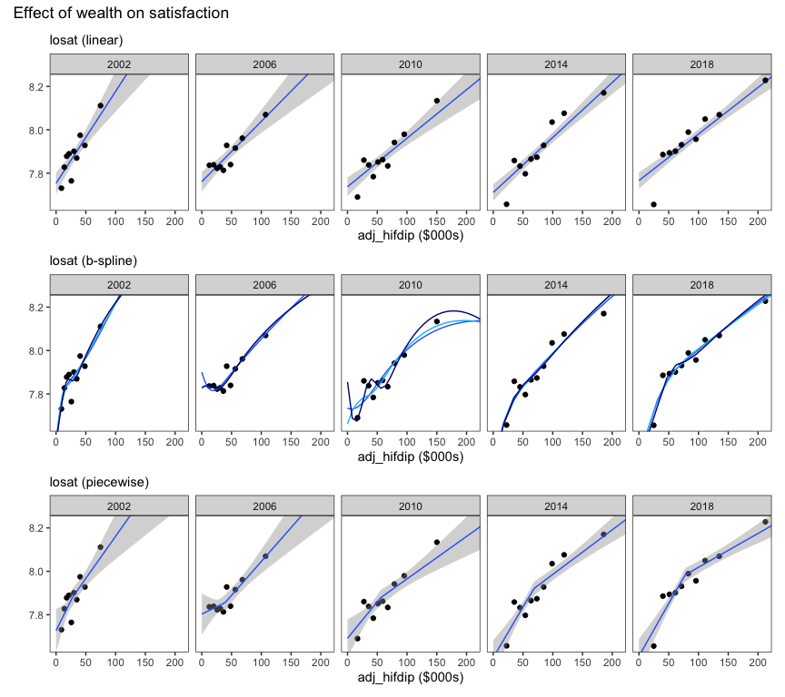
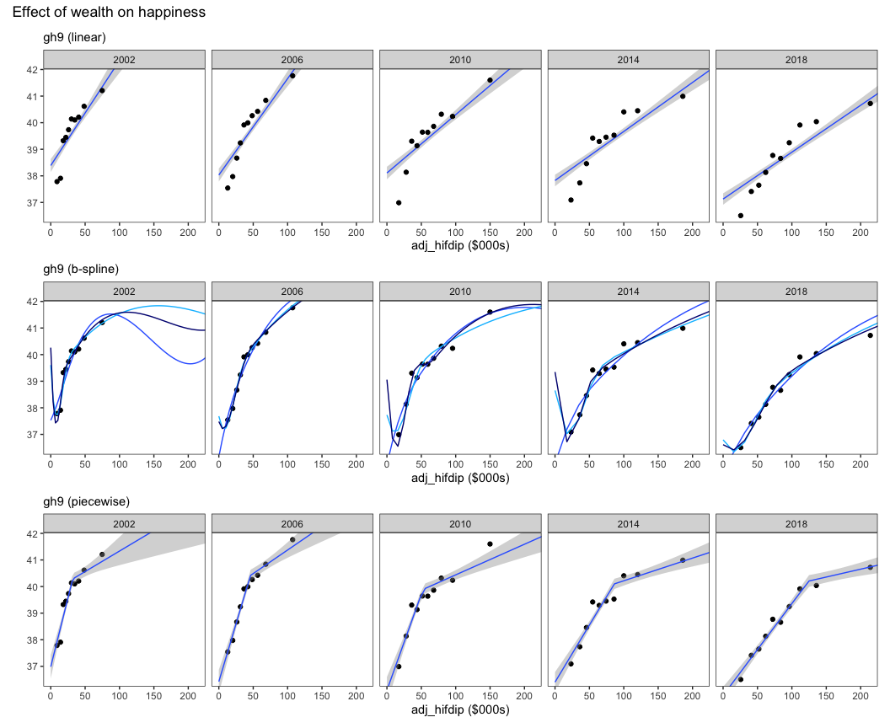
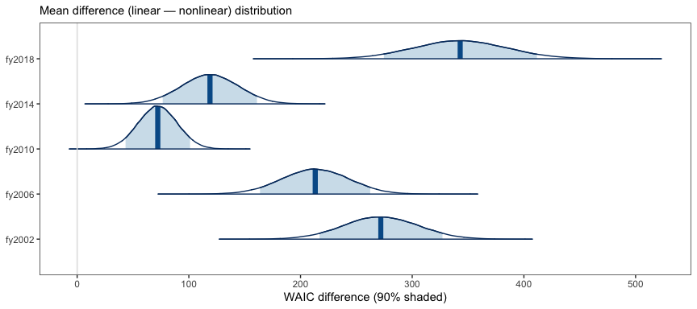
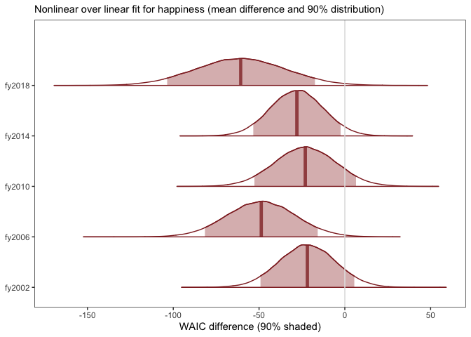
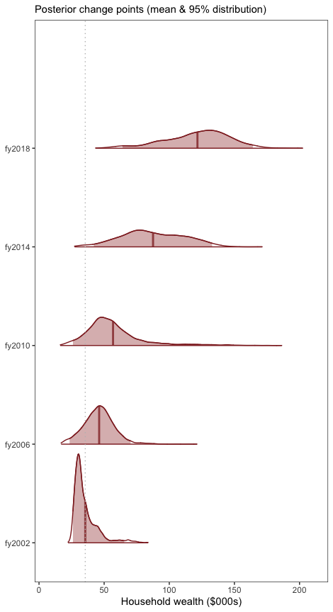

The increasing cost of happiness
================
Dr Richard Morris
Updated: 2020-09-12

-----

## Abstract

A fundamental question for governments and people is how much happiness
does a dollar buy? The accepted view among economists and psychologists
is that money and happiness increase together up to a point, after which
there is little further gain from increasing wealth. While the location
of this *change point* has been determined, and the cost of happiness
reportedly ranges between USD$60-95K, there has been no investigation as
to whether the cost of happiness has increased or decreased over time.
We tested the relationship between money and both happiness and life
satisfaction using household economic data from Australia between
2002-2016. We discovered no change point with wealth existed for
satisfaction, but the cost of happiness has increased over those 16
years faster than inflation (i.e., cost of living). Results such as
these suggest we need to understand why the cost of happiness has
increased, and to consider whether policy-goals to improve wellbeing by
increasing wealth are feasible.

 

## Background

A fundamental question for the psychology and economics of wellbeing is
just how much happiness does a dollar buy? Increasing wealth is commonly
associated with increasing happiness, however a point at which wealth no
longer increases happiness has also been [widely
observed](https://www-sciencedirect-com.ezproxy2.library.usyd.edu.au/science/article/pii/S0167487007000694)
(Clark et al., 2008; Dolan et al., 2008; Easterlin, 1974). Given that a
central goal of nations and governments is to improve wealth under the
assumption that wealth always increases wellbeing, challenges to this
notion have far reaching consequences (Frijters et al., 2020).

For instance, one [survey of 1,000
Americans](https://www.pnas.org/content/107/38/16489.full), conducted in
2010, concluded that money does make us happier – but only up to a
certain point. The findings showed that self-reported levels of
happiness increased with household wealth up to $75,000 a year. But
after that, increasing amounts of money had no further effect on
happiness (Kahneman and Deaton, 2010). Results such as these have
reinforced the view among psychologists and economists that the
relationship between wealth and measures of subjective wellbeing, such
as happiness, increases linearly up to a point (i.e., a *change point*)
after which there is little gained by further increments in wealth
(Clark, 2018; Dolan et al., 2008). We suggest that the point at which
wealth produces no further increases in happiness might be described as
the *cost* of happiness.

Subjective wellbeing is not a unitary entity (Diener et al., 2017);
studies typically distinguish between *life satisfaction*, the cognitive
appraisal of one’s own accomplishments, and *happiness*, one’s
prevailing affective state or emotional mood. Money can have different
effects on each. For instance, we have recently reported that positive
life events, such as a major financial windfall, can have a greater
impact on an individual’s satisfaction than their happiness (Kettlewell
et al., 2020). However these effects were observed as a change within
individuals, and the change was temporary as both satisfaction and
happiness returned to baseline after two years (see also Frijters et
al., 2011). Wealth also has a distinct relationship with happiness and
satisfaction across individuals was well. As described above, Kahneman
et al (2010) observed the association between household wealth and
happiness plateaud after $75,000, but they also reported that life
satisfaction continued to increase with wealth. Indeed, several
researchers have observed a similar difference between two questions
that are often used in surveys of subjective well-being: “How satisfied
are you with your life?” and “How happy are you these days?” (Howell and
Howell, 2008; Veenhoven and Hagerty, 2006). The common conclusion is
that wealth is more strongly related to satisfaction than to happiness.

Research since 2010 has revealed variations in the change point or cost
of happiness due to [world region, gender, and
education](https://www-nature-com.ezproxy2.library.usyd.edu.au/articles/s41562-017-0277-0)
(Jebb et al., 2018). However to date there has been no investigation as
to whether the *change point* varies over time. That is, has the point
at which happiness no longer increases with wealth itself changed over
time? The value of money of course generally *decreases* over time with
inflation and the cost of living and so this will *raise* the cost of
happiness, however it will not change the cost of happiness over time in
real dollar terms (i.e., adjusted for inflation). The distribution of
wealth has also changed over the last 30 years in many OECD countries
including Australia as the rich got richer while the poor stayed poor
(ref needed). Such changes in the distribution of wealth may increase
the cost of happiness if it is derived by relative wealth (e.g., Clarke
et al 2008). When the ceiling of wealth in real dollar terms is raised
over time; for any fixed income level at *t*0 (i.e., the base
year) there will be a greater disparity relative to the highest wealth
percentile at *t*n+1. If happiness is, even partly,
determined by this relative disparity then increasing the disparity will
reduce happiness amongst the poorest percentiles (while leaving
happiness amongst the richest percentiles unchanged). This may increase
the level of wealth at which happiness no longer increases. That is, as
the rich get richer, the poor get unhappier due to the increasing
relative wealth disparity and so the cost of happiness increases.
 (This section may need more clarity) 

The relationship between wealth and happiness and satisfaction are
increasingly relevant to governments and policy-makers due to the
growing recognition that increasing wealth does not necessarily lead to
improvements in wellbeing (Clark, 2018; Frijters et al., 2020). If
satisfaction but not happiness increases with wealth, then the pursuit
of both may not be a feasible policy. Likewise, if happiness increases
up to a point with wealth, or the cost of happiness changes over time,
then not everyone will agree that enhancing the happiness of those who
are already very happy is a legitimate policy objective. Conversely, it
may emphasize that the relationship between wealth and happiness is
malleable and thus amenable to policy objectives.
 (This section needs a clearer statement on
the importance of determining the increasing cost of happiness) 

We used household economic panel data from Australia (HILDA) to provide
the first investigation of whether changes in wealth and wellbeing have
changed over the last 16 years (2002-2018). We distinguished between
satisfaction and happiness as different components of subjective
wellbeing, and evaluated how each varies with household wealth. After
adjusting for age, gender, and education level, we find that
satisfaction increases linearly with household wealth, but the same
purchasing power has diminishing returns on happiness. We also discover
that the location of the change point (the *cost* of happiness) has
increased in real dollar terms since 2002.

 

## Methods

#### Wealth

Our indicator of wealth and economic security was household after-tax
income. Household income better represents economic security, since
members of the same household share expenses as well as risks; i.e.,
they can provide a direct and immediate support network when financial
shocks occur. The other major studies also used household after-tax
income as the indicator of wealth and economic security (e..g, Kahneman
and Deaton, 2010; Jebb et al., 2018), and so we follow the same standard
here as well. Household financial year disposable regular income
[(hifdip)](https://www.online.fbe.unimelb.edu.au/HILDAodd/KWCrossWaveCategoryDetails.aspx?varnt=hifdip)
from the annual HILDA survey in 2002, 2006, 2010, 2014,and 2018 was
selected. This variable in HILDA represents the sum across all household
members of financial year gross regular income less taxes on financial
year gross regular income.

Household income was provided by the University of Melbourne as imputed,
and with weighted topcodes to preserve anonymity. We removed individuals
with values above the threshold indicated for top-coding. Household
wealth was adjusted for the number of people in each household by
dividing by the square root of household size (Headey and Wooden, 2004;
Jebb et al., 2018; Kahneman and Deaton, 2010). We converted dollar
values to the base year (2002) according to CPI from the RBA, in order
to adjust for inflation
(<https://www.rba.gov.au/calculator/annualDecimal.html>).

 

#### Subjective Wellbeing

There are a variety of variables related to subjective well-being
collected annually in HILDA, but the two we used here matched the
variables we used in our previous paper (Kettlewell et al., 2020).
Namely, 1) life satisfaction
[(losat)](https://www.online.fbe.unimelb.edu.au/HILDAodd/KWCrossWaveCategoryDetails.aspx?varnt=losat),
a single item question asked each survey “How satisfied are you with
your life (0 to 10)”, and 2) happiness determined by item 9 in the SF-36
[(gh9a to
gh9i)](https://www.online.fbe.unimelb.edu.au/HILDAodd/KWCrossWaveCategoryDetails.aspx?varnt=gh9a).
The SF-36 is a widely used self-completion measure of various aspects of
physical, emotional and mental health (Ware Jr, 2000). Item 9 consists
of nine questions relating to mental health and vitality, where five
questions deal with positive and negative aspects of mental health
(e.g., “Felt so down in the dumps nothing could cheer me up”, “Been
happy”), and four questions deal with positive and negative aspects of
vitality (e.g., “feel full of life”, “felt worn out”). We reverse scored
the relevant responses and calculated a summed score so that better
wellbeing was represented by higher scores.

 

#### Modelling

We initially describe the relationship between wealth and each wellbeing
variable (happiness and satisfaction) using three different models: 1) a
simple **linear model**; 2) a cubic **B-spline model**; and 3) a
**piecewise model** (broken-stick). These three models were chosen to
represent varying degrees of complexity in the relationship between
wealth and wellbeing. The linear model was the simplest relationship
while the cubic B-spline was the most complex model (more degrees of
freedom), and chosen because it has been recently used to describe the
maximum point at which wellbeing no longer increases with wealth (i.e.,
“satiety”, Jebb et al., 2018). Following Jebb et al, we restricted the
cubic B-spline model to *n* = 4, 5 and 6 knots and show each
instantiation here. The piecewise model was chosen as the simplest
extension of a linear model which can identify a change point
(inflection) between wellbeing and wealth. The location of the change
point was a free parameter which revealed where wellbeing no longer
increased linearly with wealth.

We then compared the linear model against the piecewise model to
determine if a change point existed in each or any year between wealth
and each wellbeing variable (model selection). Finally, where a change
point existed, we determined the location of the change point for that
year (change point estimation).

*Model estimation*  
We adopted a Bayesian approach for estimating the linear and piecewise
model in the software Stan (Bürkner, 2017; Stan Development Team, 2019).
In each case,

Let y*i* ~ *N*(*μ**i*,
*σ*2*y*)

The linear model was estimated as:

*μ*i = *β*0 + *β*1*X**i*
                             (1)

Where *X*i was an individual’s household wealth ($) as well
as other covariates (age, age2, gender, education), and
*y*i was an individual’s wellbeing.

 

The piecewise model was a simple extension of this to include a free
parameter to represent the changepoint in wealth (ω) as well as the
slope after the change point (*β*2):

*μ*i = *β*0 + *β*1(*x**i* -
ω*t*)(*x**i* ≤ ω*t*) +
*β*2(*x**i* - ω*t*)(*x**i*
\> ω*t*)                              (2)

 

The above models estimated population-level (fixed) effects for each
year in the data (*t* = 2002, 2006, 2010, 2014 and 2018). Because we
were interested in the location of the change point between wealth and
wellbeing that existed across individuals within each year, we ignored
the panel design of HILDA because the dependency between observations of
the same person across years was orthogonal to our effects of interest.
We assumed an unstructured variance-covariance matrix between years, and
specified weakly informed priors for each *β*, and a uniform prior over
the restricted range of wealth values for *ω*.

*Model selection*  
To determine whether wellbeing was a linear or non-linear (e.g.,
piecewise) function of wealth, we compared the linear and piecewise
model posterior probabilities using the [Widely Applicable Information
Criterion
(WAIC)](https://bookdown.org/ajkurz/Statistical_Rethinking_recoded/overfitting-regularization-and-information-criteria.html#the-problem-with-parameters).
The WAIC is the log-posterior predictive density plus a penalty
proportional to the variance in the posterior distribution. Thus it
provides an approximation of the out-of-sample deviance that converges
to the cross-validation approximation in a large sample, with a penalty
for the effective number of parameters (degrees of freedom). For this
reason is it useful to compare two models of varying complexity, such as
our linear and piecewise model.

WAIC was defined as:

WAIC = -2(lppd - *p*WAIC)

Where lppd (log pointwise predictive density) is the total across
observations of the log of the average likelihood of each observation,
and *p*WAIC is the effective number of free parameters
determined by the sum of the variance in log-likelihood for each
observation (*i*).

*Change point estimation*  
To determine the location of the change point between wellbeing and
wealth, we modelled the relationship between wealth and wellbeing across
individuals using the piecewise model described above, and estimated the
posterior probability of the changepoint location. The posterior
distribution of the change point location for each year is presented.

 

#### Covariates

Age (and age2), gender, and education were included as
covariates, and students were removed.

 

## Results

For visualization purposes only, due to the large number of individual
data points in each year, we grouped individuals into 10 equal-sized
subgroups according to their wealth decile ($). Thus in each plot, the
mean wealth and mean wellbeing score for each decile is presented,
rather than each individual data point. Note that the line-of-best-fit
and 95% confidence intervals from each regression model *of all
individuals* is shown in overlay.

#### Household wealth and satisfaction (cognitive wellbeing)

<!-- -->

 

**Key points**

  - The relationship between satisfaction and household wealth appeared
    linear
  - The linear relationship between satisfaction and wealth became
    slightly weaker (less steep) over years
  - The cubic B-spline models indicated no satiety point (horizontal
    inflection) in satisfaction before the highest decile in any year
  - Any change point in satisfaction was as likely to be convex as
    concave

 

#### Household wealth and happiness (affective wellbeing)

<!-- -->

 

**Key points**

  - A change point is evident in each year where the linear relationship
    between happiness and wealth became abruptly weaker (less steep)
  - The overall linear relationship between happiness and wealth, as
    well as the pre-inflection slope, became weak (less steep) over
    years
  - The cubic B-spline model indicated there was no happiness satiety
    point (horizontal inflection) before the final decile in any year
  - The change point between happiness and wealth appeared to shift
    right with time.

 

#### Model selection

We compared the posterior evidence for a linear relationship between
wellbeing and wealth with the posterior evidence of a nonlinear
(piecewise) relationship (WAIClinear —
WAICpiecewise). Thus a WAIC difference greater than zero
indicates evidence for a linear relationship. A WAIC difference less
than zero indicates evidence for a nonlinear (piecewise) relationship.

##### Model evidence for linear satisfaction

<!-- -->

 

  - A linear fit between household wealth and satisfaction was credibly
    superior to a nonlinear fit in each year  
     

##### Model evidence for nonlinear happiness

<!-- -->

 

  - A nonlinear fit between household wealth and happiness was superior
    to a linear fit in each year
  - The nonlinear fit was credibly superior to a linear fit at 90% for
    each of three years (2018, 2014, 2006)

 

**Key points**

  - The posterior evidence indicates a linear model with no inflection
    point explains the relationship between satisfaction and household
    wealth in each year
  - However a nonlinear fit with at least one inflection point better
    explained the relationship between happiness and household wealth

 

##### Bayesian change point results

Shaded areas to the right of the vertical dotted line are credibly (95%)
larger than the base year (2002).

<!-- -->

 

**Key points**

  - The level of wealth at which happiness no longer increased with
    wealth (the *cost of happiness*) credibly increased between 2002 and
    2018.

 

#### Change points over time

The cost of happiness increased faster than median household wealth. As
a result, a smaller percentage of people achieved a level of wealth at
which happiness no longer increased in 2018 than in 2002:

<table>

<caption>

Household wealth median, change point and percentile

</caption>

<thead>

<tr>

<th style="text-align:left;">

year

</th>

<th style="text-align:right;">

median ($000s)

</th>

<th style="text-align:right;">

change point ($000s)

</th>

<th style="text-align:right;">

%

</th>

</tr>

</thead>

<tbody>

<tr>

<td style="text-align:left;">

fy2002

</td>

<td style="text-align:right;">

26.86

</td>

<td style="text-align:right;">

29.41

</td>

<td style="text-align:right;">

0.44

</td>

</tr>

<tr>

<td style="text-align:left;">

fy2006

</td>

<td style="text-align:right;">

38.07

</td>

<td style="text-align:right;">

41.13

</td>

<td style="text-align:right;">

0.44

</td>

</tr>

<tr>

<td style="text-align:left;">

fy2010

</td>

<td style="text-align:right;">

53.72

</td>

<td style="text-align:right;">

49.43

</td>

<td style="text-align:right;">

0.56

</td>

</tr>

<tr>

<td style="text-align:left;">

fy2014

</td>

<td style="text-align:right;">

66.62

</td>

<td style="text-align:right;">

68.85

</td>

<td style="text-align:right;">

0.48

</td>

</tr>

<tr>

<td style="text-align:left;">

fy2018

</td>

<td style="text-align:right;">

74.54

</td>

<td style="text-align:right;">

105.85

</td>

<td style="text-align:right;">

0.26

</td>

</tr>

</tbody>

</table>

  

## Conclusions

We observed the relationship between subjective wellbeing and wealth was
positive, but happiness and satisfaction have different (positive)
relationships. Satisfaction increased linearly with wealth while
happiness increased rapidly up to a point, after which further
increments in wealth produced less change - we referred to this as the
**cost** of happiness. So household wealth, and the economic security it
represents, buys happiness up to a point after which happiness and
wealth are rarely related. Satisfaction on the other hand always
increased with household wealth. The difference likely reflects the
importance of a numerical dollar value (e.g., bank balance) when
cognitively appraising one’s life achievements, versus the relevance of
that number to our everyday experience of joy or our prevailing mood.

Previous studies have challenged the notion that the positive effect of
money plateaus (Stevenson and Wolfers, 2013). After comparing life
satisfaction levels in both rich and poor countries, and rich and poor
people within a country – with “rich” being defined as an income greater
than $15,000 per person – Stevenson & Wolfers concluded: “The
relationship between wellbeing and income … does not diminish as income
rises. If there is a satiation point, we are yet to reach it.”

Since 2013, the distinct effect of wealth and happiness has also been
challenged. [A survey of 1.7 million people representing 164 countries
over 12 years (2005-2016) in the Gallup World
Poll](https://www-nature-com.ezproxy2.library.usyd.edu.au/articles/s41562-017-0277-0)
reported money was associated with no further improvement in happiness
after $60-75,000, *nor any improvement in satisfaction* after $95,000
(Jebb et al., 2018). Thus while the location differed, money had
inflected effects with both satisfaction and happiness. On the other
hand, in a nationally representative sample of 44,000 adult Americans
over 44 years in the General Social Survey (GSS) happiness continued to
increase with money (Twenge and Cooper, 2020), implying no inflection
point existed between money and happiness. Both these most recent
reports provide contradictory results regarding the nature of the
relationship between wealth and wellbeing, and both are based on data
spanning long periods of time (12-44 years). Perhaps the different
results are due to differences in the constructs being measured, or
perhaps they are due to the different effects of time between studies.

We report here for the first time that the cost of happiness increased
over time, faster than inflation or the median household income. In
2002, the cost point of happiness represented a 9% increase over median
wealth, while in 2018 it represented a 42% increase over median wealth.
This also represents a reduction from 44% to 26% in the proportion of
people who have achieved a level of household wealth beyond which their
happiness no longer depends.

According to Frijters et al. (2020), coming up with a consensus estimate
for income to translate into welbeing features high on the wellbeing
research agenda. However evidence of a linear relationship between
wellbeing and wealth calls into question the need to supplant
traditional measures of economic success such as GDP with measures of
wellbeing, such as “life satisfaction” surveys.

 

## References

Bürkner, P.-C., 2017. brms: An R package for Bayesian multilevel models
using Stan. Journal of Statistical Software 80, 1–28.
<https://doi.org/10.18637/jss.v080.i01>

Clark, A.E., 2018. Four decades of the economics of happiness: Where
next? Review of Income and Wealth 64, 245–269.

Clark, A.E., Frijters, P., Shields, M.A., 2008. Relative income,
happiness, and utility: An explanation for the easterlin paradox and
other puzzles. Journal of Economic literature 46, 95–144.

Diener, E., Heintzelman, S.J., Kushlev, K., Tay, L., Wirtz, D., Lutes,
L.D., Oishi, S., 2017. Findings all psychologists should know from the
new science on subjective well-being. Canadian Psychology/psychologie
canadienne 58, 87.

Dolan, P., Peasgood, T., White, M., 2008. Do we really know what makes
us happy? A review of the economic literature on the factors associated
with subjective well-being. Journal of economic psychology 29, 94–122.

Easterlin, R.A., 1974. Does economic growth improve the human lot? Some
empirical evidence, in: Nations and Households in Economic Growth.
Elsevier, pp. 89–125.

Frijters, P., Clark, A.E., Krekel, C., Layard, R., 2020. A happy choice:
Wellbeing as the goal of government. Behavioural Public Policy 4,
126–165.

Frijters, P., Johnston, D.W., Shields, M.A., 2011. Life satisfaction
dynamics with quarterly life event data. Scandinavian Journal of
Economics 113, 190–211.

Headey, B., Wooden, M., 2004. The effects of wealth and income on
subjective well-being and ill-being. Economic record 80, S24–S33.

Howell, R.T., Howell, C.J., 2008. The relation of economic status to
subjective well-being in developing countries: A meta-analysis.
Psychological bulletin 134, 536.

Jebb, A.T., Tay, L., Diener, E., Oishi, S., 2018. Happiness, income
satiation and turning points around the world. Nature Human Behaviour 2,
33–38.

Kahneman, D., Deaton, A., 2010. High income improves evaluation of life
but not emotional well-being. Proceedings of the national academy of
sciences 107, 16489–16493.

Kettlewell, N., Morris, R.W., Ho, N., Cobb-Clark, D.A., Cripps, S.,
Glozier, N., 2020. The differential impact of major life events on
cognitive and affective wellbeing. SSM-population health 10, 100533.

Stan Development Team, 2019. RStan: The R interface to Stan.

Stevenson, B., Wolfers, J., 2013. Subjective well-being and income: Is
there any evidence of satiation? American Economic Review 103, 598–604.

Twenge, J.M., Cooper, A.B., 2020. The expanding class divide in
happiness in the united states, 1972–2016. Emotion.

Veenhoven, R., Hagerty, M., 2006. Rising happiness in nations 1946–2004:
A reply to easterlin. Social indicators research 79, 421–436.

Ware Jr, J.E., 2000. SF-36 health survey update. Spine 25, 3130–3139.

